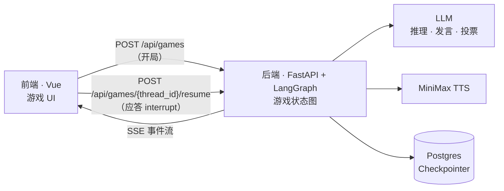
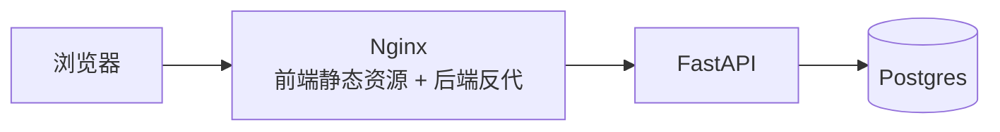

# 谁是卧底

和一桌 Agent 一起玩 “谁是卧底” ！

## 特色功能

- 每个 Agent 都有自己独立的记忆，包括游戏中各玩家的发言投票、自己的心理推测独白等。
- 每个 Agent 都是真实语音发言，发言内容和投票决策使用语言模型，语音播放采用 MiniMax 的语音模型，每个 Agent 都有自己独特的音色、语气，具有人的温度。
- 每个 Agent 发言前都会有私密推理（我是卧底吗、谁可疑），卧底会主动伪装，Agent 的发言也会站队、拉拢、排挤等，真实感很强。
- 精彩的是游戏结束后，大家会有交流复盘环节，你和 Agent 之间一起对话，说说谁是“奥斯卡”、谁很冤、评评理、夸夸人，话题是开放的。

## 技术栈

本项目后端纯手写，前端 Vibe Coding 生成。

- 前端：Vue 3 / Vite / TypeScript / Pinia
- 后端：Python 3.14 / FastAPI / LangGraph / GLM LLM / MiniMax TTS
- 存储：Postgres（Langgraph Checkpointer）
- 部署：Docker Compose

## 架构

项目采用前后端架构，前后端之间采用传统 HTTP 通信，前端请求推动后端 Langgraph 节点执行，后端通过 SSE 返回游戏进度事件。

游戏核心逻辑，也就是 Langgraph 图，在 `backend/src/core/game/` 中。



后端 LangGraph 图中，发言、投票、赛后交流节点调用 LLM/TTS 进行相应动作，轮到真人时，图中断执行，前端提交输入后 `resume` 继续执行，节点执行状态通过 Postgres Checkpointer 持久化。

前端是纯展示/交互层，解析 SSE 事件流驱动 UI、管理语音播放队列、收集真人的发言和投票。

前后端交互包含两个接口：开局、应答 interrupt。每应答一次，后端返回一段新的 SSE 流。

## 部署

Docker Compose 一键部署，包含三个容器：



## 本地开发

```bash
# 1. 环境变量
cp backend/.env.example backend/.env

# 2. 启动 Postgres
docker compose up -d postgres

# 3. 启动后端
cd backend
python -m venv .venv && source .venv/bin/activate
pip install -r requirements.txt
uvicorn src.main:app --port 8000

# 4. 启动前端
cd frontend
npm install
npm run dev
```

前端启动地址：http://localhost:5173

## 云端部署

```bash
docker compose --env-file backend/.env up -d --build
```

`.env` 随代码迁到了 `backend/` 下，compose 插值要用的 `PG_*` / `WEB_PORT` 得靠 `--env-file backend/.env` 指过去；也可以在部署机 `export COMPOSE_ENV_FILES=backend/.env`，之后不用每次带。注意不带 `--env-file` 不会报错，只是插值静默用默认值。

三个服务的分工：

- web：nginx 托管前端构建产物并反代 `/api` 到 app，同源没有 CORS 问题，对外端口 `WEB_PORT`（默认 80）
- app：后端，只在容器内网可达，密钥经 `env_file` 运行时注入，不进镜像
- postgres：数据落 named volume，端口只绑 127.0.0.1，要调试可以走 SSH 隧道连

## 目录

```
backend/             FastAPI + LangGraph 后端（目录结构 / graph 流程见 backend/README.md）
frontend/            Vue3 前端（运行说明 / mock 开关见 frontend/README.md）
docker-compose.yml   云端整套部署编排
```

配置全部集中在 `backend/.env`，逐项说明见 [backend/README.md](backend/README.md#配置env)。
