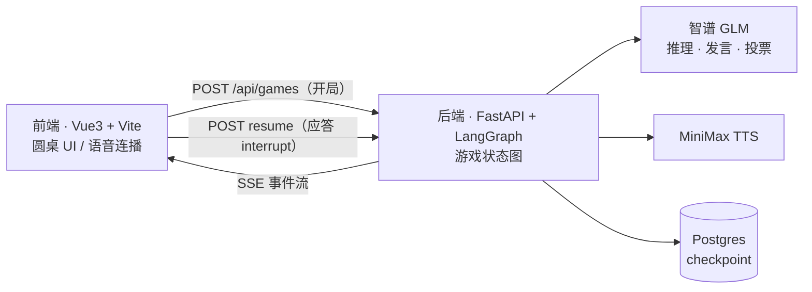
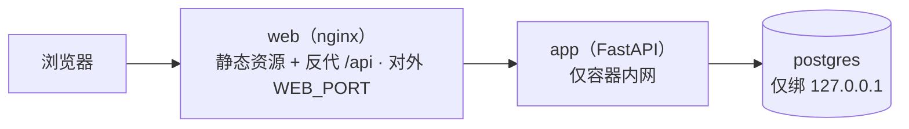

# 谁是卧底

和一桌 AI 玩「谁是卧底」：你是唯一的真人玩家，其余座位由 LLM Agent 扮演。轮流发言描述自己的词、投票淘汰嫌疑人，揪出卧底则平民胜，卧底活到最后则卧底胜。终局后还有一轮全员赛后交流，听听 AI 们怎么复盘这局。

## 功能

- 完整对局流程：轮流发言 → 全员投票 → 淘汰，支持弃票，平票加赛
- AI 玩家发言前先做一轮私密推理（我是卧底吗、谁可疑），再组织当众发言，卧底会主动伪装
- AI 发言经 TTS 合成，每名玩家固定音色，前端自动连播
- 发言、投票、淘汰、揭晓全程 SSE 实时推送
- 圆桌 UI：座位、麦克风、聊天时间线，自己的词常驻底部
- mock 模式：前端内置剧本驱动整局流程，不配后端、不用 API Key 也能体验

## 架构



后端把整局游戏编排成一张 LangGraph 状态图：AI 节点调 LLM/TTS 产出发言，轮到真人时图在 `interrupt` 处挂起，前端提交输入后 `resume` 续跑，每一步状态都 checkpoint 进 Postgres。前端是纯展示/交互层，解析 SSE 事件流驱动 UI、管理语音播放队列、收集真人的发言和投票。

真人和后端的交互只有两个接口：开局、应答 interrupt。每应答一次，后端返回一段新的 SSE 流。

部署到云端就是三个容器：



## 技术栈

- 前端：Vue 3 / Vite / TypeScript / Pinia
- 后端：Python 3.14 / FastAPI / LangGraph，LLM 走智谱 GLM（OpenAI 兼容协议），TTS 用 MiniMax
- 存储：Postgres（langgraph checkpoint）
- 部署：Docker Compose

## 本地开发

依赖：Python 3.14+、Node 20+、Docker。

```bash
# 1. 配置
cp backend/.env.example backend/.env
#    填 LLM_API_KEY（智谱，必填）、MINIMAX_API_KEY（可选，不填就没有语音）

# 2. 起 Postgres
docker compose up -d postgres

# 3. 起后端（:8000）
cd backend
python3.14 -m venv .venv && .venv/bin/pip install -r requirements.txt
.venv/bin/python -m uvicorn src.main:app --port 8000

# 4. 起前端（:5173，/api 由 vite proxy 转到 8000）
cd frontend
npm install && npm run dev
```

打开 http://localhost:5173 开局。懒得配后端的话，mock 模式可以直接玩：`cd frontend && VITE_USE_MOCK=1 npm run dev`。

## 云端部署

```bash
docker compose --env-file backend/.env up -d --build
```

`.env` 随代码迁到了 `backend/` 下，compose 插值要用的 `PG_*` / `WEB_PORT` 得靠 `--env-file backend/.env` 指过去；也可以在部署机 `export COMPOSE_ENV_FILES=backend/.env`，之后不用每次带。注意不带 `--env-file` 不会报错，只是插值静默用默认值。

三个服务的分工：

- web：nginx 托管前端构建产物并反代 `/api` 到 app，同源没有 CORS 问题，对外端口 `WEB_PORT`（默认 80）
- app：后端，只在容器内网可达，密钥经 `env_file` 运行时注入，不进镜像
- postgres：数据落 named volume，端口只绑 127.0.0.1，要调试可以走 SSH 隧道连

## 目录

```
backend/             FastAPI + LangGraph 后端（目录结构 / graph 流程见 backend/README.md）
frontend/            Vue3 前端（运行说明 / mock 开关见 frontend/README.md）
docker-compose.yml   云端整套部署编排
```

配置全部集中在 `backend/.env`，逐项说明见 [backend/README.md](backend/README.md#配置env)。
