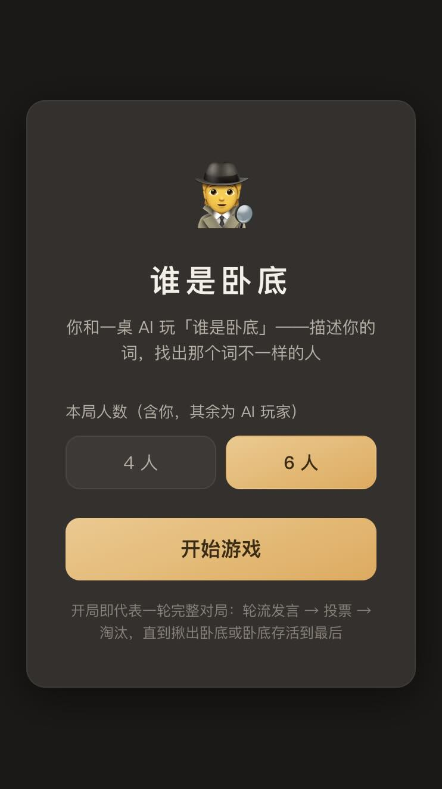
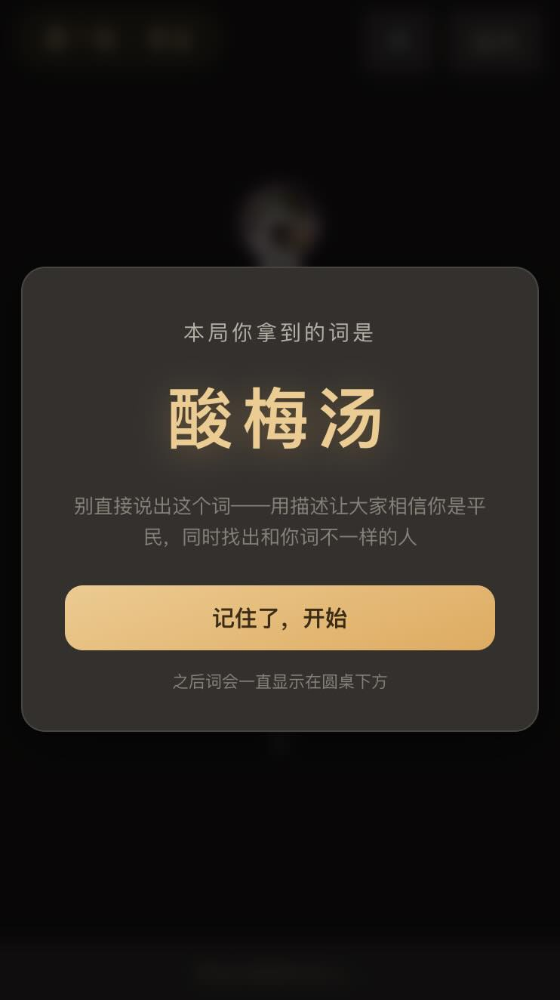
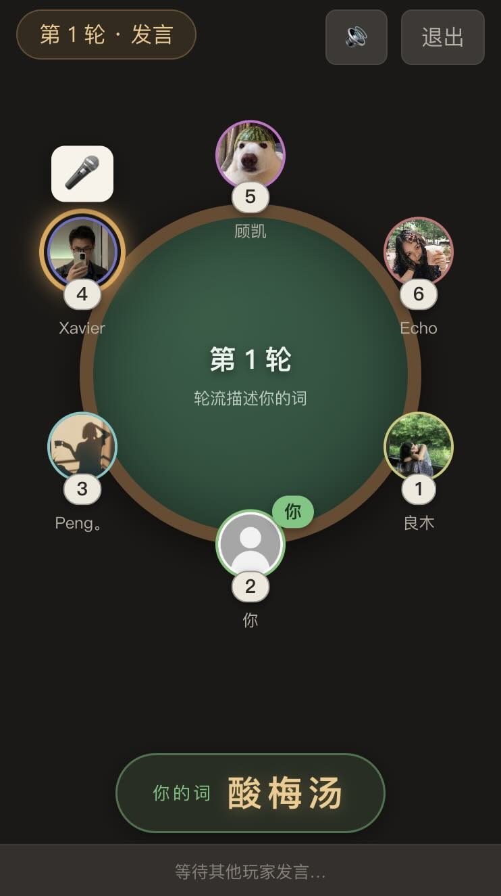
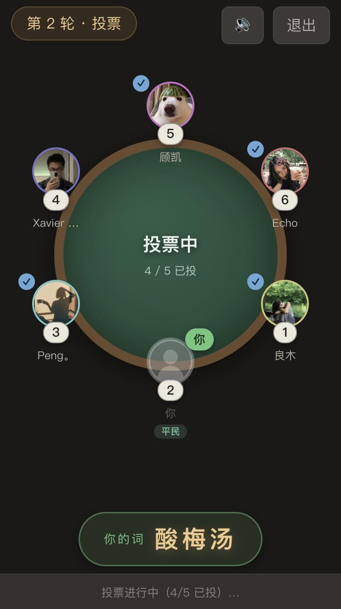
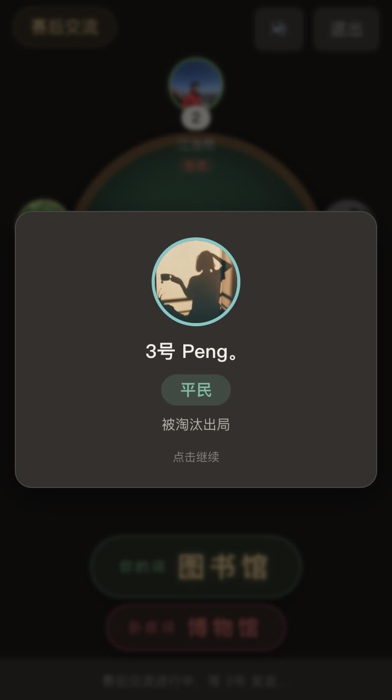
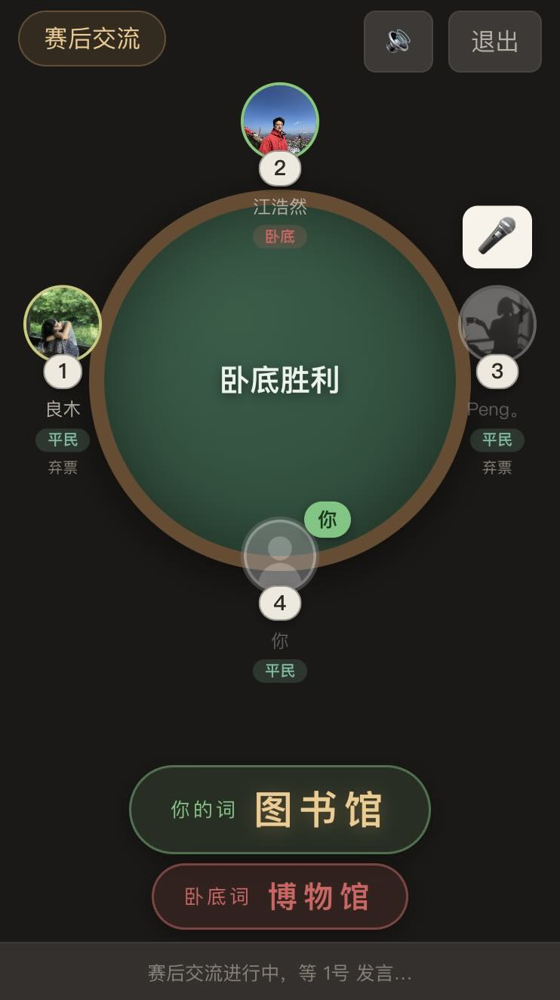
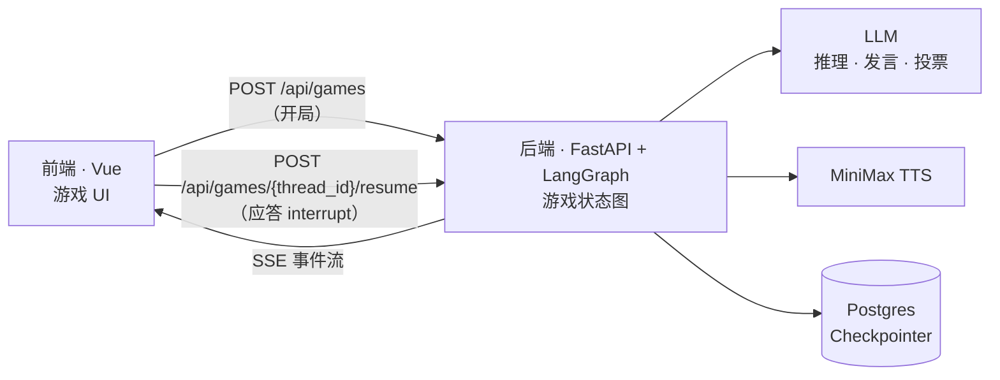
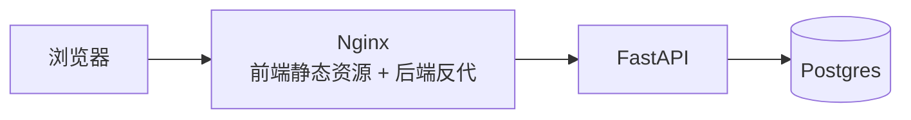

# 谁是卧底

和一桌 Agent 玩 “谁是卧底” ！

<table>
  <tr>
    <td></td>
    <td></td>
    <td></td>
  </tr>
  <tr>
    <td></td>
    <td></td>
    <td></td>
  </tr>
</table>

## 特色功能

- 每个 Agent 都有自己独立的记忆，包括游戏中各玩家的发言投票、自己的心理推测独白等。
- 每个 Agent 都是真实语音发言，发言内容和投票决策使用语言模型，语音播放采用 MiniMax 的语音模型，每个 Agent 都有自己独特的音色、语气，具有人的温度。
- 每个 Agent 发言前都会有私密推理（我是卧底吗、谁可疑），卧底会主动伪装，Agent 的发言也会站队、拉拢、排挤等，真实感很强。
- 游戏结束后，大家会有交流复盘环节，和 Agent 一起对话，说说谁是“奥斯卡”、谁很冤、评评理、夸夸人，话题是开放的。

## 技术栈

本项目后端纯手写，前端 Vibe Coding 生成。

- 前端：Vue 3 / Vite / TypeScript / Pinia
- 后端：Python 3.14 / FastAPI / LangGraph / GLM LLM / MiniMax TTS
- 存储：Postgres（Langgraph Checkpointer）
- 部署：Docker Compose

## 架构

项目采用前后端架构，前后端之间采用传统 HTTP 通信，前端请求推动后端 Langgraph 节点执行，后端通过 SSE 返回游戏进度事件。

游戏核心逻辑，也就是 Langgraph 图，在 `backend/src/core/game/` 中。



后端 LangGraph 图中，发言、投票、赛后交流节点调用 LLM/TTS 进行相应动作，轮到真人时，图中断执行。节点执行状态通过 Postgres Checkpointer 进行持久化，所以支持多轮对话，前端提交输入后 `resume` 继续执行节点。

前端是纯展示/交互层，解析 SSE 事件驱动 UI、管理语音播放队列、收集真人的发言和投票。

前后端交互包含两个接口：开局、应答 interrupt。每个请求后端都会返回一段新的 SSE 流。

## 容器部署

Docker Compose 启动命令：

```bash
# 手动设置环境变量文件，主要为 GLM LLM 和 MiniMax TTS 的 API KEY
cp backend/.env.example backend/.env
# compose 一键启动
docker compose --env-file backend/.env up -d --build
```

包含三个容器：



通过访问 80 端口，体验游戏。

## 本地开发

```bash
# 配环境变量
cp backend/.env.example backend/.env

# 启动 Postgres
docker compose up -d postgres

# 后端
cd backend
python -m venv .venv && source .venv/bin/activate
pip install -r requirements.txt
fastapi dev -e src.main:app

# 前端
cd frontend
npm install
npm run dev
```