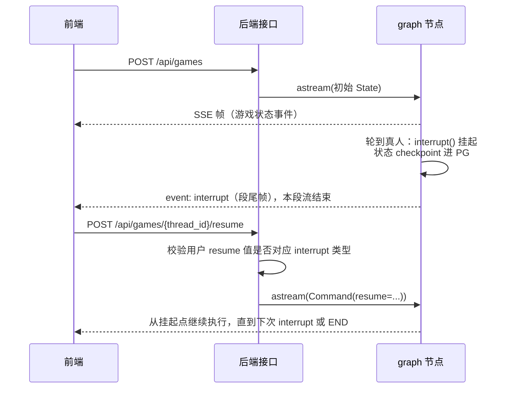
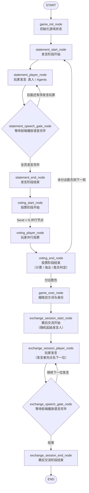

# 游戏后端

游戏状态机由 Langgraph 驱动，外层通过 FastAPI、日志、环境变量、链路跟踪等模块进行工程化。所有代码均为异步，运行在 asyncio 事件循环中。

LangGraph 状态图代表一整局游戏。AI 玩家由 LLM 驱动，真人玩家通过人工介入（`Human-in-the-loop: interrupt / resume`）进行发言投票，过程中的事件以 SSE 流推给前端，图的状态由 Postgres Checkpointer 进行持久化。

## 目录结构

```
backend/
├── Dockerfile
├── .dockerignore
├── requirements.txt
├── .env / .env.example      # 项目运行所需环境变量
└── src/
    ├── main.py              # APP 入口
    │
    ├── domains/             # 业务层
    │   ├── __init__.py      # 总路由
    │   └── game/
    │       ├── endpoints.py # handlers
    │       └── schemas.py   # requests / responses
    │
    ├── core/
    │   ├── config.py        # 配置
    │   ├── checkpointer.py  # CheckpointerProvider
    │   ├── graph.py         # GraphProvider
    │   ├── ctx.py           # 用户请求间隔离的上下文变量
    │   ├── middlewares/     # 中间件
    │   │   └── trace.py     # 链路跟踪中间件
    │   ├── logging/         # 日志模块
    │   │
    │   └── game/            # 游戏内核，不依赖服务器基础设施，CLI 可以独立跑
    │       ├── graph.py     # graph 节点流程
    │       ├── state.py     # graph 状态
    │       ├── events.py    # 游戏事件
    │       ├── nodes/       # 各阶段节点
    │       ├── prompts.py   # LLM 提示词：出词、发言、投票、交流
    │       ├── llm.py       # LLM 调用
    │       ├── tts.py       # 文字转语音
    │       └── cli.py       # 终端启动 graph，调试图流程用
    │
    └── utils/               # 工具函数
        └── sse.py
```

## 整体架构

`domains/` 负责 HTTP 协议：路由、请求校验和 SSE 响应；`core/` 包含基础设施和游戏内核（`core/game/`）。服务器侧配置由 `core/config.py` 读取，游戏侧配置由 `load_dotenv()` 读取，游戏内核可以脱离 FastAPI 和 Postgres 单独跑（CLI 模式）。

游戏核心思路为 **LangGraph 状态机 + Human-in-the-loop**，用户请求生命周期如下：



## 游戏 Graph 流程



### Interrupt / Resume 协议

真人和 Agent 玩家发言、投票和赛后交流都共享同一个节点，轮到真人玩家则中断 graph，`interrupt()` 的挂起值为 `{"type": ...}`，FastAPI 将中断类型作为 SSE 流的最后一帧下发给前端，前端按下表回传 `resume`：

| interrupt 类型 | 场景 | resume 值 |
|---|---|---|
| `need_statement` | 轮到真人发言 | 发言内容 |
| `need_vote` | 轮到真人投票 | 目标玩家 ID，`0` 表示弃票 |
| `need_exchange` | 赛后交流轮到真人 | 发言内容，并指定下一位发言玩家 |
| `speech_playback_done` | 等待语音播放确认 | `true` |

## SSE 事件一览

帧格式是 `event: <事件名>` 加 `data: <payload JSON>`，payload 没有外层包装。事件模型都在 `src/core/game/events.py`。

| 事件 | 时机 | 关键字段 |
|---|---|---|
| `game_started` | 开局（首帧） | `game_id`, `player_total` |
| `init_start` / `init_end` | 出题、分配身份完成 | `real_player_id`, `real_player_word` |
| `statement_start` / `statement_end` | 发言阶段开始 / 结束 | `game_round` |
| `statement_player_start` / `statement_player_end` | Agent 发言开始 / 结束 | `player_id`, `statement` |
| `vote_start` / `vote_end` | 投票阶段开始 / 结束 | `vote_collect`（被投人 → 投票人）, `abstain_voters`, `eliminated_player(_identity)`, `present_players` |
| `vote_player_start` / `vote_player_end` | 单个 Agent 投票开始 / 结束 | `player_id` |
| `game_over` | 胜负揭晓 | `winner`, `real_player_identity`, `is_real_player_win`, `spy_id`, `word_civilian`, `word_spy` |
| `exchange_session_start` / `exchange_session_end` | 赛后交流开始 / 结束 | — |
| `exchange_session_player_start` / `exchange_session_player_end` | 交流发言开始 / 结束 | `player_id`, `content`, `next_player_id` |
| `player_speech` | Agent 语音就绪 | `player_id`, `text`, `audio_base64`, `audio_format`, `audio_length_ms` |
| `interrupt` | 段尾：等待真人输入 | `type`（见上表） |
| `finished` | 整局结束（段尾） | `{}` |
| `error` | 运行异常（段尾） | `type`, `message` |

## API

| 方法 & 路径 | 说明 |
|---|---|
| `POST /api/games` | 开局。请求体 `{"player_total": 6}`，返回 SSE 流（`game_started` → … → `interrupt` / `finished`） |
| `POST /api/games/{game_id}/resume` | 应答 interrupt。请求体 `{"resume": <值>}`，返回下一段 SSE 流 |

SSE 都是 POST（`EventSource` 用不了），响应会带 `X-Accel-Buffering: no` 等头，防止反向代理缓冲。

## 配置（.env）

| 变量 | 说明 | 默认 |
|---|---|---|
| `LLM_API_KEY` | 智谱开放平台 Key（GLM，OpenAI 兼容协议） | 必填 |
| `MINIMAX_API_KEY` | MiniMax TTS Key，留空则语音降级，只发文字事件 | 空 |
| `MINIMAX_TTS_MODEL` | TTS 模型 | `speech-2.6-hd` |
| `ENV` | `development` / `production`，生产启用 JSON 日志并落盘 `logs/` | `development` |
| `APP_NAME` | 应用名 | `who-is-spy` |
| `ALLOW_ORIGINS` | CORS 白名单（JSON 数组，同源反代部署不用配） | `[]` |
| `PG_HOST` / `PG_PORT` / `PG_DB` / `PG_USER` / `PG_PSW` | Postgres 连接 | `localhost` / `5432` / `who_is_spy` / `postgres` / `postgres` |
| `PG_CONN_MAX` | 连接池上限 | `10` |
| `WEB_PORT` | docker compose 中 web 服务对外端口 | `80` |

## 本地运行

必须先 `cd` 到本目录（`backend/`）再执行，`src` 包和 `.env` 都是相对这个目录解析的。

```bash
# 服务端模式（需先起 Postgres：仓库根目录 docker compose up -d postgres）
python3.14 -m venv .venv
.venv/bin/pip install -r requirements.txt
.venv/bin/python -m uvicorn src.main:app --port 8000

# CLI 模式：终端里直接玩一局，InMemorySaver，不依赖 Postgres / FastAPI
# （出题/发言/投票走 LLM，语音用 macOS 自带 afplay 播放）
.venv/bin/python -m src.core.game.cli
```

## 日志与链路追踪

TraceMiddleware 从请求头取 `X-Trace-Id`，取不到就生成新 id，存进 contextvar；TraceFilter 再把它注进每一条日志，并回写响应头。开发环境是彩色控制台输出（带文件路径和行号）；`ENV=production` 时换成 JSON，同时写入 `logs/app.log` 滚动文件（500MB × 10）。
