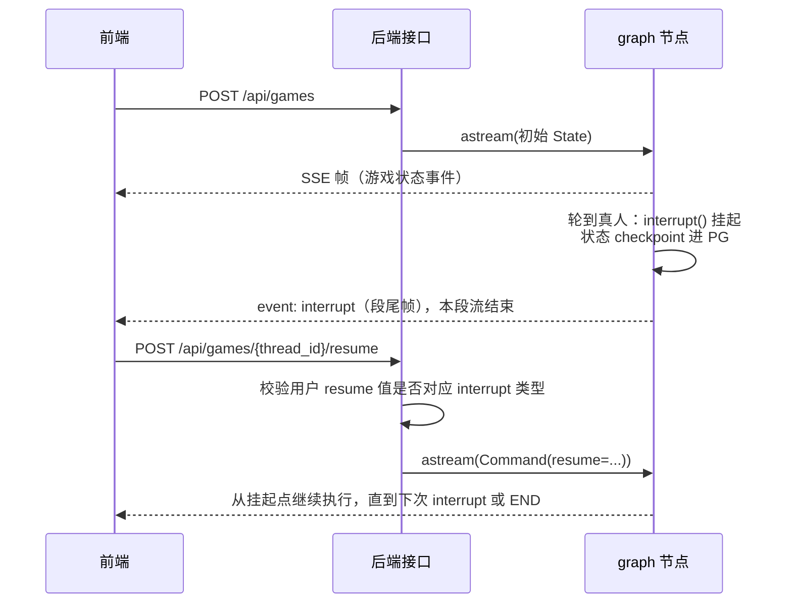

# 游戏后端

游戏状态机由 Langgraph 驱动，外层通过 FastAPI、日志、环境变量、链路跟踪等模块进行工程化。所有代码均为异步，运行在 asyncio 事件循环中。

LangGraph 状态图代表一整局游戏。AI 玩家由 LLM 驱动，真人玩家通过人工介入（`Human-in-the-loop: interrupt / resume`）进行发言投票，过程中的事件以 SSE 流推给前端，图的状态由 Postgres Checkpointer 进行持久化。

## 目录结构

```
backend/
├── Dockerfile
├── .dockerignore
├── requirements.txt
├── .env / .env.example      # 项目运行所需环境变量
└── src/
    ├── main.py              # APP 入口
    │
    ├── domains/             # 业务层
    │   ├── __init__.py      # 总路由
    │   └── game/
    │       ├── endpoints.py # handlers
    │       └── schemas.py   # requests / responses
    │
    ├── core/
    │   ├── config.py        # 配置
    │   ├── checkpointer.py  # CheckpointerProvider
    │   ├── graph.py         # GraphProvider
    │   ├── ctx.py           # 用户请求间隔离的上下文变量
    │   ├── middlewares/     # 中间件
    │   │   └── trace.py     # 链路跟踪中间件
    │   ├── logging/         # 日志模块
    │   │
    │   └── game/            # 游戏内核，不依赖服务器基础设施，CLI 可以独立跑
    │       ├── graph.py     # graph 节点流程
    │       ├── state.py     # graph 状态
    │       ├── events.py    # 游戏事件
    │       ├── nodes/       # 各阶段节点
    │       ├── prompts.py   # LLM 提示词：出词、发言、投票、交流
    │       ├── llm.py       # LLM 调用
    │       ├── tts.py       # 文字转语音
    │       └── cli.py       # 终端启动 graph，调试图流程用
    │
    └── utils/               # 工具函数
        └── sse.py
```

## 整体架构

`domains/` 负责 HTTP 协议：路由、请求校验和 SSE 响应；`core/` 包含基础设施和游戏内核（`core/game/`）。服务器侧配置由 `core/config.py` 读取，游戏侧配置由 `load_dotenv()` 读取，游戏内核可以脱离 FastAPI 和 Postgres 单独跑（CLI 模式）。

游戏核心思路为 **LangGraph 状态机 + Human-in-the-loop**，用户请求生命周期如下：



## 游戏 Graph 流程


### Interrupt / Resume 协议

真人和 Agent 玩家发言、投票和赛后交流都共享同一个节点，轮到真人玩家则中断 graph，`interrupt()` 的挂起值为 `{"type": ...}`，FastAPI 将中断类型作为 SSE 流的最后一帧下发给前端，前端按下表回传 `resume`：

| interrupt 类型 | 场景 | resume 值 |
|---|---|---|
| `need_statement` | 轮到真人发言 | 发言内容 |
| `need_vote` | 轮到真人投票 | 目标玩家 ID，`0` 表示弃票 |
| `need_exchange` | 赛后交流轮到真人 | 发言内容，并指定下一位发言玩家 |
| `speech_playback_done` | 等待语音播放确认 | `true` |

## 游戏流程事件 / SSE 事件

SSE 帧格式：

```
event: <Event Name>
data: <Payload JSON>

...
```

| 事件 | 时机 |
|---|---|
| `game_started` | 开局（首帧） |
| `init_start` / `init_end` | 出题、分配身份完成 |
| `statement_start` / `statement_end` | 发言阶段开始 / 结束 |
| `statement_player_start` / `statement_player_end` | Agent 发言开始 / 结束 |
| `vote_start` / `vote_end` | 投票阶段开始 / 结束 |
| `vote_player_start` / `vote_player_end` | 单个 Agent 投票开始 / 结束 |
| `game_over` | 胜负揭晓 |
| `exchange_session_start` / `exchange_session_end` | 赛后交流开始 / 结束 |
| `exchange_session_player_start` / `exchange_session_player_end` | 交流发言开始 / 结束 |
| `player_speech` | Agent 语音就绪 |
| `interrupt` | 等待真人输入（作为 SSE 尾帧）|
| `finished` | 整局结束（作为 SSE 尾帧）|
| `error` | 运行异常（作为 SSE 尾帧）|

各事件类型所包含字段见代码：`src/core/game/events.py`。

## CLI 模式运行游戏内核

```bash
python -m src.core.game.cli
```

终端输出：

```bash
Event: type='init_start'
Event: type='init_end' real_player_id=4 real_player_word='候车室'
Event: type='statement_start' game_round=1
Event: type='statement_player_start' player_id=1
Event: type='statement_player_end' player_id=1 statement='我来说说我的词吧。这是一个公共场所，去的人基本上都需要等待，里面有座位可以坐，通常会听到广播提醒。大家先说说看，看看我们是不是一路的。'
Event: player_speech 玩家1 语音(14364ms)：我来说说我的词吧。这是一个公共场所，去的人基本上都需要等待，里面有座位可以坐，通常会听到广播提醒。大家先说说看，看看我们是不是一路的。
Event: type='statement_player_start' player_id=2
Event: type='statement_player_end' player_id=2 statement='我拿到的词确实和1号说的很像，也是一个公共场合，大家去那里通常不是目的，而是中间的一个环节，需要在那里等着，有座椅可以休息，也经常能听到广播通知。我觉得1号说的和我理解的差不多，应该是一路的。其他人也说说看吧。'
Event: player_speech 玩家2 语音(18684ms)：我拿到的词确实和1号说的很像，也是一个公共场合，大家去那里通常不是目的，而是中间的一个环节，需要在那里等着，有座椅可以休息，也经常能听到广播通知。我觉得1号说的和我理解的差不多，应该是一路的。其他人也说说看吧。
Event: type='statement_player_start' player_id=3

...
```