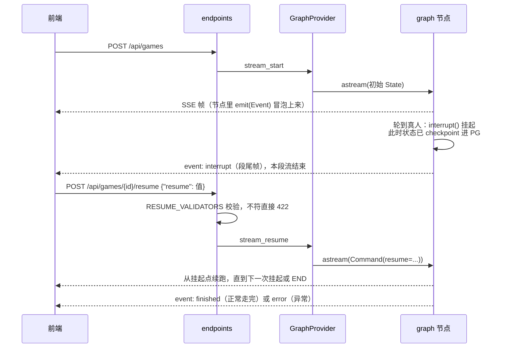
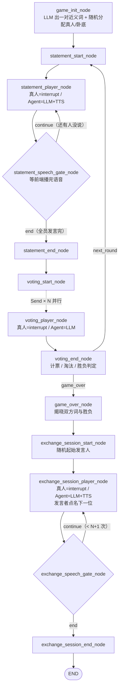

# who-is-spy 后端

FastAPI + LangGraph 写的「谁是卧底」服务端。整局游戏是一张 LangGraph 状态图：AI 玩家由 LLM 驱动，真人玩家通过 **interrupt / resume** 在图的挂起点接入，过程事件以 SSE 流推给前端，状态 checkpoint 进 Postgres。

## 目录结构

```
backend/
├── Dockerfile               # python:3.14-slim，pip/apt 走阿里源
├── .dockerignore            # .env、.venv、logs 等不进镜像
├── requirements.txt
├── .env / .env.example      # 全部配置：LLM/TTS Key、PG 连接、部署环境
└── src/
    ├── main.py              # FastAPI 入口，lifespan 里初始化连接池/checkpointer 并编译 graph
    │
    ├── domains/             # HTTP 层
    │   ├── __init__.py      #   总路由，统一挂 /api 前缀
    │   └── game/
    │       ├── endpoints.py #   POST /api/games（开局）、POST /api/games/{id}/resume（应答），都返回 SSE 流
    │       └── schemas.py   #   StartRequest / ResumeRequest
    │
    ├── core/
    │   ├── config.py        # pydantic-settings 读 .env（游戏侧的 Key 由 game/* 自己 load_dotenv，两边互不依赖）
    │   ├── checkpointer.py  # psycopg AsyncConnectionPool + AsyncPostgresSaver，建表幂等
    │   ├── graph.py         # GraphProvider：编译 graph，负责 start/resume 的 SSE 推流（astream + 事件转帧）
    │   ├── ctx.py           # trace_id 的 contextvar 存取
    │   ├── middlewares/
    │   │   └── trace.py     #   X-Trace-Id：透传请求头或生成新 id，回写响应头
    │   ├── logging/         #   开发=彩色控制台，生产=JSON + 滚动文件 logs/；filter 注入 trace_id
    │   │
    │   └── game/            #   游戏内核，不依赖服务器基础设施，CLI 可独立跑
    │       ├── graph.py     #     build_graph()：节点与边的组装
    │       ├── state.py     #     State TypedDict：固定状态 / 变动状态 / 历史（add reducer）
    │       ├── events.py    #     Event 家族（pydantic）+ emit()：写进 custom stream
    │       ├── nodes/       #     各阶段节点：game_init / statement / voting / game_over / exchange_session
    │       ├── prompts.py   #     出题、规则、发言、投票、交流各阶段的 prompt 构造
    │       ├── llm.py       #     ChatOpenAI 指到智谱 GLM（OpenAI 兼容），结构化输出 + 重试封装
    │       ├── tts.py       #     MiniMax TTS，音色按玩家固定分配，没 Key 或失败就降级成纯文字事件
    │       └── cli.py       #     终端里直接玩一局：InMemorySaver + input() + afplay，调试图流程用
    │
    └── utils/
        └── sse.py           #   SSE 帧构造：event: <名>\ndata: <JSON>\n\n
```

## 整体架构

`domains/` 只管 HTTP 协议——路由、请求校验、SSE 响应头；`core/` 是基础设施和游戏内核，其中 `core/game` 对服务器基础设施零依赖，可以脱离 FastAPI 和 Postgres 单独跑（CLI 模式就是这么做的）。核心思路是 **LangGraph 状态机 + human-in-the-loop**，一次请求的生命周期大致是这样：



实现上的几个点：

- game_id 就是 langgraph 的 thread_id。开局时 endpoints 生成 uuid，checkpointer 按它隔离每一局的状态
- 节点只调 `emit(Event)`，由 GraphProvider 统一把 custom stream 转成 SSE 帧（`src/utils/sse.py`），CLI 模式消费的是同一批事件
- 真人输入没有专门的 HTTP 语义。真人和 Agent 走的是同一个节点，轮到真人就 `interrupt()` 挂起，前端带着值 `resume` 回来，节点拿到返回值继续跑——对图来说，真人只是「一个比较慢的 Agent」
- 并发投票用 Send fanout：`voting_player_node` 对每位在场玩家并行分发，`vote_history` / `history` 在 State 里是 `Annotated[list, add]` reducer，多路并行写入自动合并，汇合到 `voting_end_node` 计票
- resume 时如果没有挂起的 interrupt 会直接 500。本项目不支持断点续跑/断线重连，连接断了这一局就作废

## 游戏 Graph 流程



各阶段的规则：

- 发言阶段：`active_player_ptr` 在 `present_players` 上顺位推进。真人发言没有事件回执（前端本地回显），Agent 发言经 `statement_player_end` + `player_speech`（语音）下发。每人说完都过一道 speech gate（`interrupt speech_playback_done`），等前端确认语音播完再继续，让图的推进跟听感同步
- 投票阶段：在场玩家并行投票，`decision = 0` 是弃票。`voting_end_node` 计票：
  - 全员弃票或平票 → 无人淘汰，进下一轮
  - 投出卧底 → 平民胜
  - 投出平民且场上剩 ≤ 2 人 → 卧底胜
  - 否则淘汰该平民，进下一轮
- 赛后交流：胜负揭晓后进入，共 `player_total + 1` 次发言。起始发言人随机，之后由上一位发言者点名下一位；真人被点名时用 `need_exchange` 提交「内容 + 点名」

### Interrupt / Resume 协议

`interrupt()` 的挂起值就是 `{"type": ...}`，SSE 段的最后一帧原样下发（`event: interrupt`），前端按下表回传 `resume`：

| interrupt type | 场景 | resume 值 |
|---|---|---|
| `need_statement` | 轮到真人发言 | 字符串（发言内容） |
| `need_vote` | 轮到真人投票 | 数字（目标玩家 ID；`0` = 弃票） |
| `need_exchange` | 赛后交流轮到真人 | `"发言内容\|\|下一位玩家ID"` |
| `speech_playback_done` | 等语音播放确认 | `true` |

`resume` 字段必填。`endpoints.py` 里的 `RESUME_VALIDATORS` 会在入口先校验值的形状（类型不符返回 422），免得坏值在 interrupt 被消费之后才炸、把 thread 留在奇怪的状态。

## SSE 事件一览

帧格式是 `event: <事件名>` + `data: <payload JSON>`，payload 没有外层包装。事件模型都在 `src/core/game/events.py`。

| 事件 | 时机 | 关键字段 |
|---|---|---|
| `game_started` | 开局（首帧） | `game_id`, `player_total` |
| `init_start` / `init_end` | 出题 / 分配身份完成 | `real_player_id`, `real_player_word` |
| `statement_start` / `statement_end` | 发言阶段开始 / 结束 | `game_round` |
| `statement_player_start` / `statement_player_end` | Agent 发言开始 / 结束 | `player_id`, `statement` |
| `vote_start` / `vote_end` | 投票阶段开始 / 结束 | `vote_collect`（被投人→投票人）, `abstain_voters`, `eliminated_player(_identity)`, `present_players` |
| `vote_player_start` / `vote_player_end` | 单个 Agent 投票开始 / 结束 | `player_id` |
| `game_over` | 胜负揭晓 | `winner`, `real_player_identity`, `is_real_player_win`, `spy_id`, `word_civilian`, `word_spy` |
| `exchange_session_start` / `exchange_session_end` | 赛后交流开始 / 结束 | — |
| `exchange_session_player_start` / `exchange_session_player_end` | 交流发言开始 / 结束 | `player_id`, `content`, `next_player_id` |
| `player_speech` | Agent 语音就绪 | `player_id`, `text`, `audio_base64`, `audio_format`, `audio_length_ms` |
| `interrupt` | 段尾：等待真人输入 | `type`（见上表） |
| `finished` | 整局结束（段尾） | `{}` |
| `error` | 运行异常（段尾） | `type`, `message` |

## API

| 方法 & 路径 | 说明 |
|---|---|
| `POST /api/games` | 开局。请求体 `{"player_total": 6}`，返回 SSE 流（`game_started` → … → `interrupt` / `finished`） |
| `POST /api/games/{game_id}/resume` | 应答 interrupt。请求体 `{"resume": <值>}`，返回下一段 SSE 流 |

SSE 都是 POST（`EventSource` 用不了），响应带 `X-Accel-Buffering: no` 等头，防止反代缓冲。

## 配置（.env）

| 变量 | 说明 | 默认 |
|---|---|---|
| `LLM_API_KEY` | 智谱开放平台 Key（GLM，OpenAI 兼容协议） | 必填 |
| `MINIMAX_API_KEY` | MiniMax TTS Key；留空则语音降级，只发文字事件 | 空 |
| `MINIMAX_TTS_MODEL` | TTS 模型 | `speech-2.6-hd` |
| `ENV` | `development` / `production`（生产启用 JSON 日志 + 落盘 `logs/`） | `development` |
| `APP_NAME` | 应用名 | `who-is-spy` |
| `ALLOW_ORIGINS` | CORS 白名单（JSON 数组；同源反代部署不用配） | `[]` |
| `PG_HOST` / `PG_PORT` / `PG_DB` / `PG_USER` / `PG_PSW` | Postgres 连接 | `localhost` / `5432` / `who_is_spy` / `postgres` / `postgres` |
| `PG_CONN_MAX` | 连接池上限 | `10` |
| `WEB_PORT` | docker compose 中 web 服务对外端口 | `80` |

## 本地运行

必须 cd 到本目录（`backend/`）下跑，`src` 包和 `.env` 都是相对这个目录解析的。

```bash
# 服务端模式（需先起 Postgres：仓库根目录 docker compose up -d postgres）
python3.14 -m venv .venv
.venv/bin/pip install -r requirements.txt
.venv/bin/python -m uvicorn src.main:app --port 8000

# CLI 模式：终端里直接玩一局，InMemorySaver，不依赖 Postgres/FastAPI
# （出题/发言/投票走 LLM，语音用 macOS 自带 afplay 播放）
.venv/bin/python -m src.core.game.cli
```

## 日志与链路追踪

TraceMiddleware 给每个请求取 `X-Trace-Id` 头或生成新 id，存进 contextvar，TraceFilter 把它注进每条日志并回写响应头。开发环境是彩色控制台输出（带文件路径/行号）；`ENV=production` 时换成 JSON，同时写 `logs/app.log` 滚动文件（500MB × 10）。
