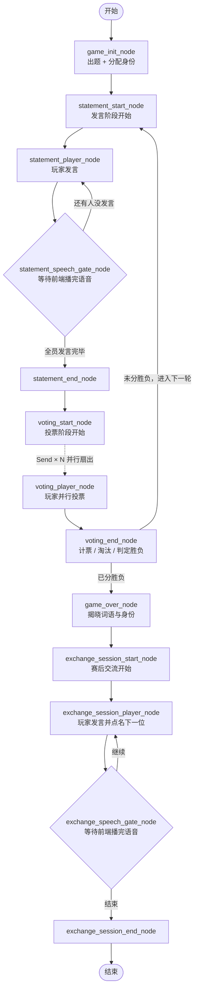
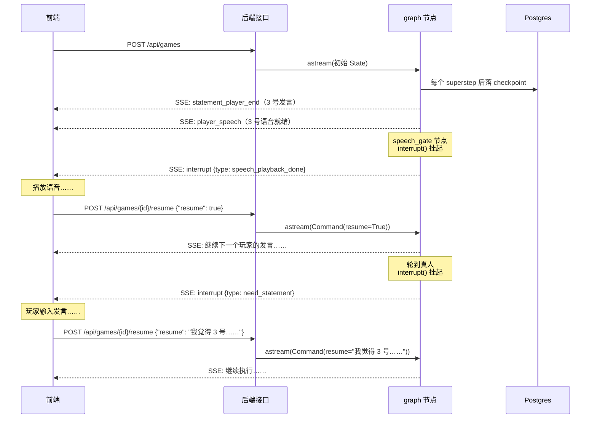

# 前言

前阵子想做个项目把 LangGraph 知识点从头到尾过一遍，于是开发了一个桌游「谁是卧底」：你坐在一张六人桌前，另外五个位置是 Agent 玩家。它们用语言模型推理和发言，用 MiniMax 合成语音，每个人都有不同音色；游戏中 Agents 会互相试探、站队、栽赃，卧底还会主动伪装。一局结束不散场，大家可以坐下来复盘，说说谁最会装、谁最冤。

项目已经开源，仓库里前后端各一个目录（后端纯手写，前端是 Vibe Coding 生成的）：

> **https://github.com/xvrzhao/who-is-spy**


先看一眼它在终端里跑起来是什么样（内核可以脱离 Web 服务单独跑，后面会讲怎么做到）：

```bash
Event: type='init_end' real_player_id=4 real_player_word='候车室'
Event: type='statement_start' game_round=1
Event: type='statement_player_start' player_id=1
Event: type='statement_player_end' player_id=1 statement='我来说说我的词吧。这是一个公共场所，去的人基本上都需要等待，里面有座位可以坐，通常会听到广播提醒。大家先说说看，看看我们是不是一路的。'
Event: player_speech 玩家1 语音(14364ms)：我来说说我的词吧。……
Event: type='statement_player_start' player_id=2
Event: type='statement_player_end' player_id=2 statement='我拿到的词确实和1号说的很像，也是一个公共场合，大家去那里通常不是目的，而是中间的一个环节……我觉得1号说的和我理解的差不多，应该是一路的。'

...
```

注意第 2 位玩家的发言——它在**主动确认自己和 1 号是不是同一阵营**。这不是我们写死的台词，是模型读了发言记录之后自己判断出来的策略。

### 这篇会讲什么

游戏本身很简单，但它几乎把 LangGraph 常用到的东西都用上了。这篇会按「一步步做出来」的顺序，依次走过：

| 知识点 | 出现在哪一步 |
|---|---|
| 状态、节点、边、条件边 | 把游戏规则翻译成状态图 |
| 结构化输出（`with_structured_output`） | 让模型稳定地返回「思考 + 发言」两个字段 |
| 状态 reducer（`Annotated[list, add]`） | 并行分支写同一份历史记录 |
| 并行节点（`Send` API） | 六个玩家同时投票 |
| 事件流（`stream_mode="custom"`） | 让前端实时看到「现在轮到谁说话」 |
| 多轮对话（checkpointer / `thread_id`） | 一局游戏跨多个 HTTP 请求 |
| 人工介入（`interrupt` / `Command(resume=...)`） | 真人玩家发言，以及等语音播完 |

工程化的部分（异步、项目分层、日志、连接池、SSE 落地）是另一篇的事，这篇只关心游戏内核本身。内核代码全在 `backend/src/core/game/` 下，一共十来个文件，可以对照着看。

## 一、把游戏规则翻译成状态机

「谁是卧底」的规则一句话能说完：多数人拿到同一个词（平民词），一个人拿到相近但不同的词（卧底词），大家轮流用一句话描述自己的词但不能说出来，然后投票淘汰最可疑的人；淘汰到卧底平民赢，剩下两个人时卧底赢。

### 一个 prompt 硬解行不行

最省事的做法是写一个大 prompt：把六个人的发言、投票、身份全塞给模型，让它一口气输出整局游戏。这个做法能跑，但有三处硬伤：

1. **不可中断**。真人玩家要发言、要投票，游戏必须停下来等人。一把梭的 prompt 一旦开始生成就停不下来了。
2. **不可恢复**。一局游戏要好几分钟，中间要经过好几次「等人输入」。如果靠一个 HTTP 请求从头挂到尾，连接一断，进度就全丢了。
3. **不可观测**。前端需要知道「现在轮到 3 号发言」「投票结果是谁被淘汰了」。整段文本生成完才拿到结果，界面上只能转圈。

把游戏拆成状态机，这三个问题就都变成了工程问题：状态可以 checkpoint、执行可以中断、每个节点做完什么可以发事件。LangGraph 恰好就是干这个的。

### 状态长什么样

先定义状态。它是整局游戏唯一的数据来源，节点读它、改它、把它交给下一个节点。

`backend/src/core/game/state.py` 全文：

```python
from enum import Enum
from typing import TypedDict, Annotated, Literal
from operator import add

GameStage = Literal["statement", "voting"]
PlayerIdentity = Literal["civilian", "spy"]

class StateRecord(TypedDict):
    """发言记录"""
    game_round: int
    player_id: int
    content: str
    thinking: str

class VoteRecord(TypedDict):
    """投票记录"""
    game_round: int
    voter_id: int
    decision: int # 投给谁，0 表示弃票
    reason: str
    
class RawRecord(TypedDict):
    """游戏过程文本记录"""
    content: str
    is_private: bool            # 是否为仅单一玩家可见的私密记录
    read_only_by: int | None    # 私密记录对哪个玩家可见

class State(TypedDict):

    # ------------------- 游戏初始化后 确定不变的状态 -------------------

    player_total: int       # 玩家数量
    real_player_id: int     # 真实玩家ID，其余为Agent
    spy_id: int             # 卧底ID
    word_civilian: str      # 平民词
    word_spy: str           # 卧底词


    # ------------------------ 游戏中 变动的状态 -----------------------

    game_round: int                         # 当前游戏轮数
    stage: GameStage                        # 游戏阶段：statement 发言、voting 投票
    present_players: list[int]              # 当前剩余玩家/尚未被淘汰的玩家
    active_player_ptr: int                  # 当前该哪个玩家发言，值为 present_players 数组的索引


    # ----------------------- 游戏过程中 历史记录 -----------------------

    state_history: Annotated[list[StateRecord], add]    # 发言历史记录
    vote_history: Annotated[list[VoteRecord], add]      # 投票历史记录
    history: Annotated[list[RawRecord], add]            # 游戏过程文本记录，用于给 llm 决策


    # ----------------------- 游戏结束 最后的赢家 -----------------------

    winner: PlayerIdentity | None                       # 最后胜利的身份：civilian / spy


    # ---------------------- 游戏结束后 交流阶段状态 ---------------------

    exchange_next: int                          # 赛后交流阶段下一个发言的玩家ID
    exchange_round: int                         # 交流轮次（有多少次玩家发言）
    exchange_histoty: Annotated[list[str], add] # 交流阶段玩家聊天记录
```

几个值得留意的点。

**状态就是 `TypedDict`**，不是 Pydantic 模型。LangGraph 对两种都支持，`TypedDict` 写起来更轻，运行时也不做校验——反正写进状态的只有我们自己的节点。

**`Literal` 用来当枚举**。`GameStage` 只有 `"statement"` 和 `"voting"` 两个值，`PlayerIdentity` 只有 `"civilian"` 和 `"spy"`。这样类型检查器能帮忙，运行时又只是普通字符串。

**三种 record，各管一摊**：`RawRecord` 是给模型看的文本流水（发言、投票、内心独白都揉成一句话），`VoteRecord` 是给计票用的结构化数据（谁投了谁），`StateRecord` 是发言的结构化留档。为什么不用一份就够，看到第四、五节就明白了——**给模型看的东西和给程序算的东西，需求完全不一样**。

**`Annotated[list[...], add]` 是 reducer**，这是全文第一个关键点。默认情况下，节点返回的字段会**覆盖**状态里的旧值。但历史记录显然不能覆盖，得追加。`Annotated` 的第二个参数就是告诉 LangGraph：这个字段的更新方式不是覆盖，而是调用 `add`（也就是 `operator.add`，列表相加）把新旧两份拼起来。

```python
history: Annotated[list[RawRecord], add]            # 游戏过程文本记录，用于给 llm 决策
```

单线程顺序执行的时候，reducer 看起来有点多余——手动 `state["history"] + new_records` 也能达到同样效果。但等到第五节六个玩家同时投票时，reducer 就是唯一能把并发写入正确合并起来的机制。

## 二、第一个能跑的版本：节点、边、条件边

有了状态，接下来定义图和它的骨架。

游戏一共五个阶段：**初始化 → 发言 → 投票 → （判定胜负，没结束就回发言）→ 揭晓 → 赛后交流**。其中发言和投票是循环的，直到有人获胜。

`backend/src/core/game/graph.py` 全文：

```python
from langgraph.graph import StateGraph, END

from src.core.game.state import State
from src.core.game.nodes.statement import (
    statement_start_node,
    statement_player_node,
    statement_speech_gate_node,
    route_after_statement,
    statement_end_node,
)
from src.core.game.nodes.voting import (
    voting_start_node,
    fanout_to_voting_players,
    voting_player_node,
    voting_end_node,
    route_after_voting,
)
from src.core.game.nodes.exchange_session import (
    exchange_session_start_node,
    exchange_session_player_node,
    exchange_speech_gate_node,
    route_after_exchange,
    exchange_session_end_node,
)
from src.core.game.nodes.game_init import game_init_node
from src.core.game.nodes.game_over import game_over_node


def build_graph(checkpointer):
    """构建游戏状态图；checkpointer 由运行方注入（CLI 用 InMemorySaver，服务端用 AsyncPostgresSaver）"""

    return (
        StateGraph(State)

        # ----------------------- add nodes -----------------------

        # 游戏初始化节点
        .add_node(game_init_node)
        # 发言阶段节点
        .add_node(statement_start_node)
        .add_node(statement_player_node)
        .add_node(statement_speech_gate_node)
        .add_node(statement_end_node)
        # 投票阶段节点
        .add_node(voting_start_node)
        .add_node(voting_player_node)
        .add_node(voting_end_node)
        # 游戏结束节点
        .add_node(game_over_node)
        # 赛后交流节点
        .add_node(exchange_session_start_node)
        .add_node(exchange_session_player_node)
        .add_node(exchange_speech_gate_node)
        .add_node(exchange_session_end_node)

        # ----------------------- add edges -----------------------

        .set_entry_point("game_init_node")
        .add_edge("game_init_node", "statement_start_node")
        .add_edge("statement_start_node", "statement_player_node")
        .add_edge("statement_player_node", "statement_speech_gate_node")
        .add_conditional_edges(
            "statement_speech_gate_node",
            route_after_statement,
            {
                "continue": "statement_player_node",
                "end": "statement_end_node",
            },
        )
        .add_edge("statement_end_node", "voting_start_node")
        .add_conditional_edges(
            "voting_start_node",
            fanout_to_voting_players,
            ["voting_player_node"],
        )
        .add_edge("voting_player_node", "voting_end_node")
        .add_conditional_edges(
            "voting_end_node",
            route_after_voting,
            {
                "next_round": "statement_start_node",
                "game_over": "game_over_node",
            }
        )
        .add_edge("game_over_node", "exchange_session_start_node")
        .add_edge("exchange_session_start_node", "exchange_session_player_node")
        .add_edge("exchange_session_player_node", "exchange_speech_gate_node")
        .add_conditional_edges(
            "exchange_speech_gate_node",
            route_after_exchange,
            {
                "continue": "exchange_session_player_node",
                "end": "exchange_session_end_node",
            }
        )
        .add_edge("exchange_session_end_node", END)

        # ----------------------- compile -----------------------

        .compile(checkpointer=checkpointer)
    )
```

整个图是一串链式调用，读起来就是它的执行顺序。

**`.add_node(fn)` 只传函数，不传名字**。LangGraph 默认拿函数名当节点名，所以边里写的是 `"game_init_node"` 这样的字符串。好处是少写一遍名字；代价是**边上的节点名只是普通字符串**——类型检查器和 IDE 都帮不上忙。好在 LangGraph 自己会兜底：`compile()` 内部会校验一遍，重命名函数却忘了改边，启动时就会直接抛 `ValueError: Found edge starting at unknown node '...'`，而不是等到某局游戏跑到那一步才炸。**错得早，总比错得晚好。** 团队里用的话，我还是倾向于显式写 `.add_node("name", fn)`。

**`.set_entry_point()` 指定入口**。也可以用官方的 `START` 常量连边，效果一样；这里用的是 `set_entry_point`，`END` 则从 `langgraph.graph` 导入。

**边的两种形态**。`.add_edge("a", "b")` 是无条件边，做完 a 一定去 b。`.add_conditional_edges("a", router, 映射表)` 是条件边：先调 `router(state)` 拿到一个字符串，再到映射表里查出下一个节点。

条件边的 router 就是一个普通函数，读状态、返回字符串：

```python
def route_after_statement(state: State) -> str:
    """statement_player_node 的条件路由"""

    # 指针越界说明本轮所有玩家都已发言
    if state["active_player_ptr"] >= len(state["present_players"]):
        return "end"
    return "continue"
```

**发言循环就是靠 `active_player_ptr` 这个指针转起来的**。轮到谁发言，就取 `present_players[active_player_ptr]`；发完言指针 +1；指针越界了说明这一轮所有人都说完了，从 `"end"` 走到投票阶段。用一个整数索引代替「谁还没发言」的集合，好处是状态足够小、也天然可序列化。

把上面的代码画成图：



这张图里有两处先按下不表：`voting_start_node` 用虚线连出去的那条并行边（第五节），以及两个 `speech_gate` 节点（第七节）。先假设它们不存在，图照样能跑通——只是前端看不到进度、语音也没法播。

## 三、让 LLM 说人话：结构化输出

节点要调模型了。第一个需求是**发言**：模型得输出「心里怎么想的」和「嘴上说什么」两部分，前者只有自己能看到，后者所有人可见。

### 为什么不直接解析文本

最直接的做法是让模型输出一段带格式的文本，比如用 `【思考】...【发言】...` 分隔，然后正则拆开。能跑，但很脆：模型可能少写一个标记，可能多写一段解释，可能用全角括号，可能把思考写成了列表。每多一种写法，就多一处解析失败的分支。

`with_structured_output` 走的是另一条路：把 Pydantic 模型交给模型，让它按 JSON Schema 或者工具调用的格式返回。LangChain 负责把返回值解析回 Pydantic 对象，我们拿到的就是有类型保证的实例。

四个阶段的输出各定义一个模型：

```python
class Statement(BaseModel):
    """玩家发言，包括发言思考和发言内容"""
    thinking: str = Field(description="玩家发言前的思考")
    content: str = Field(description="玩家发言内容")

class Vote(BaseModel):
    """玩家投票，包括投票理由和投票决定"""
    reason: str = Field(description="玩家投票前的分析和理由")
    decision: int = Field(description="玩家投给的玩家数字ID；若几名玩家的可疑程度接近、把握不大，返回 0 表示弃票")

class Words(BaseModel):
    """“谁是卧底”游戏中发给玩家的一对词语"""
    word_civilian: str = Field(description="平民词，大多数玩家拿到的词")
    word_spy: str = Field(description="卧底词，少数卧底玩家拿到的词")

class ExchangeStatement(BaseModel):
    """玩家赛后交流，包含发言内容和指定下一位发言的玩家"""
    content: str = Field(description="玩家赛后想要说的话")
    next_player_id: int = Field(description="想听听哪位玩家的想法，指定下一位发言的玩家")
```

`Field(description=...)` 不是装饰，它就是给模型看的字段说明。`decision` 那句「若几名玩家的可疑程度接近、把握不大，返回 0 表示弃票」，直接决定了后面投票阶段会不会出现弃票这种结果——**字段描述是这个方案里最值得花心思的地方**。

绑定方式是把模型挂到 llm 上，得到一个可调用的 runnable：

```python
state_llm = llm.with_structured_output(Statement, method="function_calling").with_retry()
```

`method="function_calling"` 是让模型走工具调用（tool call）通道返回结构化数据，而不是走 JSON mode。理由很实际：这里用的 GLM 在工具调用上比 JSON mode 稳。`.with_retry()` 是 LangChain 自带的失败重试。

### 一个真实的坑：`with_retry` 兜不住 `None`

上线之后遇到一个偶发问题：**模型偶尔不按约束输出工具调用，`with_structured_output` 会返回 `None` 而不是抛异常**。

而 `.with_retry()` 只捕获异常。返回值是 `None` 对它来说是一次成功的调用，不会重试。于是一个本可以重试一次就好的问题，会一路变成节点里的 `AttributeError: 'NoneType' has no attribute 'thinking'`。

解决办法是单独包一层：

```python
async def ainvoke_structured(runnable: Runnable, messages, attempts: int = 3):
    """调用 with_structured_output 的 runnable，模型偶发不按约束输出 tool call 时会返回 None，视为失败重试

    （with_retry 只捕获异常，无法覆盖 None 返回值，故单独包一层）
    """
    last = None
    for _ in range(attempts):
        last = await runnable.ainvoke(messages)
        if last is not None:
            return last
    raise RuntimeError(f"structured output 连续 {attempts} 次返回 None")
```

所有结构化调用都走这个函数。日志里现在能看到「连续 3 次返回 None」这种明确的失败，而不是一堆莫名其妙的 `NoneType` 报错。**这类问题写博客比写代码更值得记录**——它不会出现在任何文档的示例里。

### 出题：如何避免模型每次都出「苹果 / 梨」

初始化节点要生成一对词语。这里有个很容易踩的坑：直接把「给我出一对词」丢给模型，十次有八次是苹果/梨、饺子/馄饨、猫/狗。因为温度再高，最高频的词对还是最高频。

解决办法是**在 prompt 里制造随机性 + 显式拉黑**：

```python
# 出题主题域：每次调用随机抽取一个，避免相同 prompt 下模型每次都落回同一个最高频词对（苹果/梨、饺子/馄饨之类）
WORD_TOPICS = [
    "水果蔬菜", "饮品", "主食小吃", "甜品零食", "调味料",
    # ... 共 30 个主题域
    "情绪与性格", "抽象概念",
]

WORD_FORMS = ["两字词语", "三字词语", "四字成语"]

# 模型默认输出频率最高的一批词对，每次随机抽几个进 prompt 显式排除
OVERTIRED_PAIRS = [
    "苹果/梨", "饺子/馄饨", "包子/馒头", "可乐/雪碧", "咖啡/奶茶",
    # ...
]
```

每次出题随机抽一个主题域、一个字数要求、六组要避开的词对，然后：

```python
    index = randint(2, 9)
    avoid = "、".join(sample(OVERTIRED_PAIRS, k=6))
    return f"""你是“谁是卧底”游戏的出题人，请为主题域「{topic}」构思一对词语（平民词与卧底词），要求：
# ...
请先在脑中构思 10 组不同的候选词对，然后只输出其中的第 {index} 组，通过工具调用返回，不要输出任何其他内容或解释。"""
```

「先构思 10 组，只输出第 N 组」这句是个便宜好用的技巧：它强迫模型在采样时铺开，而不是一头扎进最高频的那个答案。

prompt 里还有两条约束是这个游戏能不能玩起来的关键：

- 两个词必须是**同级并列关系**，不能是「水果 / 苹果」这种上下位词——不然卧底一轮就暴露了；
- 差异必须**藏在质感、语境、使用场景里**，不能在「有颜色 / 没颜色」「甜 / 咸」「室内 / 户外」这种非此即彼的属性上对立——不然拿卧底词的人一句话就露馅。

这两条不是语言上的讲究，是玩法上的硬要求。**prompt 写得好不好，在这里直接决定了游戏能玩几轮。**

## 四、每个 Agent 的记忆：私密独白与可见性过滤

游戏能跑了，但它不好玩——六个 Agent 像六台复读机，说的都是同一句话的变体。因为它们**看到的东西完全一样**，行为自然也一样。

要有意思，就得让它们**各自知道一些别人不知道的事**。这就是「每个 Agent 都有自己独立的记忆」这条特色。

### 一个直觉但错误的做法

最直觉的做法是给每个 Agent 各存一份消息列表：`agent_memory[1]`、`agent_memory[2]`……轮到谁发言就把谁的那份拼进 prompt。

这份方案的问题是显而易见的：**同一句话要存 N 份**。3 号说了什么，1 到 6 号的记忆里都得各追加一条。状态会膨胀得很快，而且要在每个节点里维护 N 个写入点，任何一处漏掉就是一个 Agent 失忆。

### 共用一本台账，读的时候按人过滤

这个项目走的是另一条路：**只存一份 append-only 的记录，读的时候按「谁在看」过滤**。

记录的类型里直接带上了可见性：

```python
class RawRecord(TypedDict):
    """游戏过程文本记录"""
    content: str
    is_private: bool            # 是否为仅单一玩家可见的私密记录
    read_only_by: int | None    # 私密记录对哪个玩家可见
```

写进 `history` 的每一行都带着「这是公开的，还是只说给某个人听的」。公开记录的 `read_only_by` 是 `None`，私密记录填上属主的玩家 ID。

然后所有 prompt 构造函数开头都做同一件事：

```python
def get_statement_prompt(player_id: int, your_word: str, history: list[RawRecord]):
    records = [record["content"] for record in history if not record["is_private"] or record["read_only_by"] == player_id]
```

一行列表推导，就是全部的记忆隔离逻辑。它在这份代码里一字不差地出现了三次——发言（`prompts.py:77`）、投票（`:98`）、赛后交流（`:119`），每次都是同一句话。

代价是**这份台账本身是上帝视角**——所有 Agent 的私密独白都躺在同一个 `history` 里。但对它做隔离的是 prompt 层，而这个台账从来没有下发给前端（私密行不发事件），所以玩家看不到。用一句过滤换掉 N 份状态，我觉得很划算。

### 私密独白从哪来

答案是**同一节点、同一次 LLM 调用、多返回一个字段**。

前面 `Statement` 模型里的 `thinking` 就是它。发言节点拿到结果后，把一次调用拆成两行写进台账：

```python
        append_raw_records = [
            RawRecord(content=f"玩家 {current_player} 内心独白：{thinking}", is_private=True, read_only_by=current_player),
            RawRecord(content=f"玩家 {current_player} 发言：{statement}", is_private=False, read_only_by=None),
        ]
```

投票节点同理，把 `Vote.reason` 写成私密行、投票结果写成公开行。所以**下一轮轮到同一个 Agent 发言时，它能读到「我自己上一轮是怎么想的」，但读不到别人是怎么想的**。

怎么让模型愿意配合产出这个 `thinking`？靠 prompt 里的字段说明：

```
现在轮到你发言了，请返回以下两个字段：
- thinking：你的内心推理，只有你自己可见，后续轮次也只有你能回看。请结合你的词语和以上记录分析：自己更可能是平民还是卧底、哪些玩家的描述与你的词语兼容、谁最可疑，可以直接提到你的词语；
- content：你的当众发言，所有玩家都能看到。根据 thinking 中的判断来组织——若你可能是卧底，就向平民的描述靠拢伪装自己；若你可能是平民，就与同伴的描述互相印证；不能直接说出词语本身；不需要做自我介绍；
```

注意 `thinking` 的说明里特意写了「可以直接提到你的词语」——因为它是私密的，说出来不会泄底。这样模型才能做真正的推理（「我的词是候车室，1 号说的是等车的地方，兼容」），而不是小心翼翼地打哑谜。**公开/私密的差异，恰恰是让模型能同时做到「想得清楚」和「藏得住」的前提。**

### 身份也是未知的

这个项目里还有一个更狠的设计：**没有任何一个玩家知道自己的身份，包括卧底自己**。

规则 prompt 里明说了这点：

```
- {player_total} 个玩家（玩家中包含 1 个卧底，其他玩家均为平民）；
- 每个玩家均不知道自己的身份；
```

所以卧底不是「拿到卧底词后开始演」，而是**根据别人的描述反推自己是不是那个异类**。规则 prompt 里的四条「游戏技巧」就是把这个反推过程讲给模型听：

```
### 游戏技巧
1. 因为玩家不知道自己的身份，有可能自己是平民，也有可能是卧底，所以需要根据各个玩家的发言和投票，来猜测和判断；
2. 在前几轮（特别是首轮），不要将自己的词语描述的太详细，先试探性地模糊描述，要根据其他玩家的描述情况来揣测自己是不是与众不同的那个（卧底）；
3. 若发现其他玩家有可能和自己是一样的词语（自己有可能是平民），则可以给对方更多的暗示，让对方感受到你和他是一队的（都是平民）；
4. 若发现自己可能和其他玩家的词语都不一样，自己有可能是卧底，那么要将自己伪装成和其他玩家是一样的词语，让他们误投，来争取自己最后的胜利；
```

第 3 条是「站队 / 拉拢」，第 4 条是「伪装」。**代码里没有任何一行实现这些策略**，它们完全靠这一段 prompt 涌现。这也是为什么开头那段终端输出里，2 号会主动说「应该是一路的」——它在执行第 3 条。

## 五、并行投票：Send API + reducer

发言是严格串行的（得按顺序听别人说话），但**投票不用**——每个玩家独立决策，互相看不到对方投谁。

如果写成串行，六个玩家就是六次 LLM 调用排队，一轮投票要等十几秒。并发起来能把这段时间压到一次调用的量级。

### 用 `Send` 扇出

LangGraph 的并行有几种做法，这里用的是 `Send`。它是一个特殊的返回值：router 返回一个 `Send` 列表，LangGraph 就会为每一个 `Send` 起一个**独立的分支**执行目标节点，各自带着自己的输入。

```python
def fanout_to_voting_players(state: State):
    return [Send("voting_player_node", VotingState(
        game_round=state["game_round"],
        player_total=state["player_total"],
        player=player,
        word=state["word_spy"] if player == state["spy_id"] else state["word_civilian"],
        history=state['history'],
        real_player_id=state["real_player_id"],
        present_players=state["present_players"],
    )) for player in state["present_players"]]
```

对应到编译期，条件边的第三个参数要写成**列表**形式，而不是前面那种映射表：

```python
        .add_conditional_edges(
            "voting_start_node",
            fanout_to_voting_players,
            ["voting_player_node"],
        )
```

### 分支的私有输入：`VotingState`

注意 `Send` 的第二个参数是 `VotingState`，一个**独立于 `State` 的小状态**：

```python
class VotingState(TypedDict):
    game_round: int
    player_total: int
    player: int # 投票人ID
    word: str   # 投票人手持的词语
    history: list[RawRecord]
    real_player_id: int # 本局游戏的真实玩家ID
    present_players: list[int] # 当前在场玩家ID，用于校验投票目标
```

这是 `Send` 很好用的一个地方：**每个分支可以有自己的一份输入**。这里最要紧的是 `player` 和 `word`——每个投票人看到的词不一样（卧底看到的是卧底词），所以「谁在投」和「他拿的什么词」必须在扇出的时候就确定下来，而不是让每个分支自己去 `State` 里算。

`history` 则是原样透传。这里其实可以更省——每个分支只需要一份按自己过滤过的历史。但既然过滤发生在 prompt 构造那一层（第四节），传同一份进去也不会串味。

### fan-in：reducer 登场的时刻

N 个分支跑完，都会走到 `voting_end_node`：

```python
        .add_edge("voting_player_node", "voting_end_node")
```

问题来了：**N 个分支同时返回 `vote_history` 和 `history`，状态怎么合并？**

答案就是第一节埋下的那个 reducer。`vote_history` 和 `history` 都声明了 `Annotated[list[...], add]`，所以 LangGraph 不会让它们互相覆盖，而是把 N 份返回值依次相加。**没有 reducer 的话，六个分支的投票会有五个丢掉。**

顺带一提，`voting_end_node` 里计票时也确实依赖了这一点：

```python
def voting_end_node(state: State) -> State:
    round = state['game_round']
    votes = state['vote_history']
    votes = [vote for vote in votes if vote["game_round"] == round]
```

先按当前轮次过滤一遍。因为 `vote_history` 是**跨轮累加**的（前面几轮的票都还在里面），不筛轮次会把历史票算进去。

### 为什么不用 `asyncio.gather`

既然都是并发，为什么不干脆在节点里 `asyncio.gather` 一把？

因为那会绕开 LangGraph 的三件事：

- **状态合并**。`gather` 回来的结果得自己手动合进状态，合并逻辑散在节点里，reducer 就白写了；
- **superstep 语义**。LangGraph 的并行分支属于同一个 superstep，全部完成才算这一步结束，checkpoint 也在这个边界上落盘。用 `gather` 就是把并行藏在节点内部，外面看还是一个黑盒；
- **中断**。这一条后面会显得更重要——真人玩家的投票也是这 N 个分支中的一支，它会在分支里 `interrupt()` 挂起，其余分支的结果等它。这是 `gather` 做不到的。

整个后端的图里，`asyncio.gather` 和 `asyncio.create_task` 一次都没出现过——**所有并发都由 LangGraph 的 superstep 调度**。这一点在第二篇讲异步的时候还会再提。

## 六、让前端看见图在跑：事件流

到这里，游戏逻辑已经完整了。但把它接到前端，还缺一样东西：**图在服务端跑，前端怎么知道现在轮到谁说话、谁被淘汰了？**

### 用 `emit` 主动推事件

LangGraph 提供 `get_stream_writer()`，拿到一个 writer，往里丢什么，外面 `astream` 就能收到什么。整个封装只有三行：

```python
def emit(event: Event) -> None:
    """在节点内调用，将事件写入 custom stream；未启用 streaming 时为 no-op"""
    get_stream_writer()(event)
```

节点里想要通知外界的时候，`emit` 一下就完事：

```python
async def statement_player_node(state: State) -> State:
    ...
    emit(StatementPlayerStart(player_id=current_player))
    ...
    emit(StatementPlayerEnd(player_id=current_player, statement=statement))
```

消费端则是指定 `stream_mode="custom"`，只收这类自定义事件：

```python
            async for chunk in self.graph.astream(
                graph_input, 
                self.get_config(thread_id), 
                stream_mode=["custom"], 
                version="v2"
            ):
```

只订阅 `custom` 是有意的选择。LangGraph 还能流 `messages`（token 级）和 `updates`（每个节点返回的状态增量），但这里都不需要：token 级流式会让前端做打字机效果，可这个游戏真正需要的是「整句说完了，开始播语音」这种**离散的里程碑**；`updates` 则会把这个节点写进状态的**整段增量**推出去——其中包括 `history` 里那些私密独白——那正好是第四节费劲藏起来的东西。

### 一个基类 + 字面量类型

所有事件都是一个 Pydantic 基类的子类，各自带一个 `Literal` 类型的 `type` 字段：

```python
class Event(BaseModel):
    """custom stream 事件基类"""
    pass


class StatementPlayerEnd(Event):
    type: Literal["statement_player_end"] = "statement_player_end"
    player_id: int
    statement: str


class PlayerSpeech(Event):
    """Agent 发言语音（发言/赛后交流环节）"""
    type: Literal["player_speech"] = "player_speech"
    player_id: int
    text: str                      # 字幕原文
    audio_base64: str = ""         # mp3 音频 base64
    audio_format: Literal["mp3"] = "mp3"
    audio_length_ms: int = 0       # 音频时长毫秒
```

这个设计有个很实用的副作用：**`type` 可以直接当作 SSE 的事件名**。往外发的时候只需要：

```python
    @staticmethod
    def game_event_to_sse(event: Event):
        return sse_event(event.type, event.model_dump(mode="json", exclude={"type"}))
```

`event.type` 当事件名，模型序列化后的字典（去掉重复的 `type`）当载荷。前端拿到的就是标准的 SSE 帧：

```
event: statement_player_end
data: {"player_id": 1, "statement": "我来说说我的词吧。……"}
```

主要的事件类型如下（完整字段见 `backend/src/core/game/events.py`）：

| 事件 | 时机 |
|---|---|
| `init_start` / `init_end` | 出题、分配身份完成（`init_end` 带回真人自己的 ID 和词） |
| `statement_start` / `statement_end` | 发言阶段开始 / 结束 |
| `statement_player_start` / `statement_player_end` | 某个 Agent 发言开始 / 结束 |
| `vote_start` / `vote_end` | 投票阶段开始 / 结束（`vote_end` 带计票结果和淘汰者） |
| `game_over` | 胜负揭晓（带双方词语和卧底 ID） |
| `exchange_session_*` | 赛后交流的各个节点 |
| `player_speech` | Agent 语音就绪（音频以 base64 内联） |

### 顺带的好处：内核不依赖流式

`emit` 的注释里那句「未启用 streaming 时为 no-op」值得单独说一句。它意味着**不流式的时候，这些 `emit` 调用不会报错**——`get_stream_writer()` 在没开 `custom` 流的情况下会返回一个什么都不做的 writer。所以同一份内核，既可以在服务端或 CLI 里 `astream` 起来把事件推出去，也可以被某个调用方用 `ainvoke` 直接跑完：**事件是可选副作用，而不是必需输出**。内核因此不必关心「外面到底有没有人在听」。

一个内核，两种跑法，靠的是「事件是可选副作用」这个约定。

## 七、多轮对话与人工介入：checkpointer / thread_id / interrupt / resume

现在到了整个项目最核心的一节。

一局游戏有几分钟长，中间要停好几次：等真人发言、等真人投票、等真人赛后说话。这几个「等」摆在面前，问题就很具体了：

- HTTP 请求不能一直挂着等几分钟（中间断线就全丢了）；
- 进程重启、部署发版，不能把正在进行的局弄没；
- 服务端不可能开个定时器猜「前端大概播完了」。

LangGraph 的三样东西正好对上：**checkpointer 存状态、`thread_id` 认大局、`interrupt` / `resume` 管挂起和继续**。

### 状态存哪儿：把 checkpointer 注入进来

图在编译的时候接收一个 checkpointer：

```python
        .compile(checkpointer=checkpointer)
```

而 `build_graph` 的签名是：

```python
def build_graph(checkpointer):
    """构建游戏状态图；checkpointer 由运行方注入（CLI 用 InMemorySaver，服务端用 AsyncPostgresSaver）"""
```

**注意它是参数，不是写死的模块级依赖。** 这个注入点带来的好处比看上去大：

```python
# CLI：不依赖 Postgres，内存存就够
graph = build_graph(InMemorySaver()) # CLI 路径不依赖 Postgres
```

```python
# 服务端：状态落 Postgres，跨请求、跨重启都在
graph_provider.init(checkpointer_provider.saver)
```

同一个图、同一份节点代码，在终端里跑用内存、在服务器上跑用 Postgres，**内核完全不需要知道区别**。连接池怎么建、服务怎么起，都是第二篇的事。

### `thread_id` 就是一局游戏

有了 checkpointer，每次调用图都要告诉它「这次操作哪一局的存档」。这个标识就是 `thread_id`：

```python
    @staticmethod
    def get_config(thread_id: str):
        return {"configurable": {"thread_id": thread_id}}
```

在这个项目里，`thread_id` 就是开局时生成的 `game_id`：

```python
@router.post("", summary="游戏开局")
async def start_game(req: StartRequest):
    game_id = uuid4().hex
    stream = graph_provider.stream_start(game_id, req.player_total)
```

一个 `uuid4` 对应一局游戏，一直用到结束。**图只编译一次，被所有对局共享**，每局的状态靠 `thread_id` 隔开——这也是 checkpointer 方案比「每个游戏一个图实例」省事的地方。

### `interrupt` 挂起，`Command(resume=...)` 继续

节点里调用 `interrupt(value)`，图的执行就在这一行**停下来**：当前状态落盘，调用方拿到 `value`。之后用 `Command(resume=...)` 再次调用同一个 `thread_id`，图会从那一行**继续往下走**，而 `interrupt()` 的返回值就是传进来的 resume 值。

真人发言的那段代码是这样的：

```python
    if current_player == state["real_player_id"]:
        # 真实用户发言
        real_player_statement = interrupt({"type": "need_statement"})
        append_state_records = [StateRecord(game_round=state['game_round'], player_id=current_player, content=real_player_statement, thinking="")]
```

**真人和 Agent 共用同一个节点**，靠 `current_player == state["real_player_id"]` 一行分流。Agent 去调模型，真人则 `interrupt` 挂起——挂起时抛出去的是 `{"type": "need_statement"}`，前端一看就知道该弹出发言输入框了。

共用一个节点的好处是**逻辑对称**：不管谁发言，后面的「写进历史记录」那一段是同一份代码，不会出现「真人的发言忘了进记忆」这种偏差。

挂起和恢复一共有四种场景：

| `interrupt` 的类型 | 场景 | resume 传什么 |
|---|---|---|
| `need_statement` | 轮到真人发言 | 发言内容（字符串） |
| `need_vote` | 轮到真人投票 | 目标玩家 ID（`0` 表示弃票） |
| `need_exchange` | 赛后交流轮到真人 | `"发言内容\|\|下一位玩家ID"` |
| `speech_playback_done` | 等待语音播放完成 | `true` |

前端每提交一次，后端就带着 resume 值重新把图跑起来，一直到**下一个** `interrupt` 或者图的终点。这条链路在第二篇会展开讲。

### 一个漂亮的小设计：把「等语音播完」也变成 interrupt

上表最后一行是个特别值得说的地方。

Agent 的语音是服务端合成、客户端播放的（下一节细讲）。那么问题来了：**服务端怎么知道前端把这段语音播完了，可以轮到下一位了？**

三个朴素方案都有毛病：服务端 `sleep(音频时长)`（时长不准、阻塞线程）；前端播完发个请求（那就得为「同步」专门开一个接口和一份状态）；轮询（纯浪费）。

这个项目直接把「等播完」做成了图里的一个节点：

```python
def statement_speech_gate_node(state: State) -> State:
    """等待客户端确认语音播放完成后再继续"""
    
    interrupt({"type": "speech_playback_done"})
    return {}
```

节点体就两行：挂起，抛一个「等我确认」的信号。前端收到 `speech_playback_done` 后开始播语音，播完调 resume 传 `true`，图从这里继续，走到 `route_after_statement` 决定下一位是谁。

**为什么这个设计好**：服务端零等待、零轮询，不需要知道音频到底多长；状态在盘上，用户中途刷新页面也不影响；而且**说话节奏的主动权在客户端**——前端音频队列里有几条没播完，它就不 resume，天然的背压。

### 完整时序

把这一节串起来看：



这里有个细节值得注意：**一个 HTTP 请求只负责一段**，从请求发出到下一个 `interrupt` 为止。`interrupt` 就是这条流的分页符。第二篇会围绕这一点展开——包括前端是怎么用一个 SSE 帧就知道「该轮到我输入了」的。

## 八、给 Agent 一张嘴：MiniMax TTS

到这里，Agent 已经会思考、会说话、会藏心思了，但都还是文字。加上语音之后，一桌人的感觉才真正出来。

### 音色按座位号固定分配

六个人的音色不能乱换。做法朴素得不能再朴素——一张常量表，用座位号取模：

```python
# 中文系统音色表（按玩家 ID 取模固定分配，保证同一玩家音色不变）
VOICE_IDS = [
    "moss_audio_3dee3d0c-7ce6-11f0-8ff8-2a857e2646d2", # 良木
    "moss_audio_9c223de9-7ce1-11f0-9b9f-463feaa3106a", # 江浩然
    "moss_audio_ad5baf92-735f-11f0-8263-fe5a2fe98ec8", # Peng。
    "moss_audio_6ebc4801-a9c3-11f1-b918-4e871ed0d69e", # Xavier
    "Chinese (Mandarin)_Southern_Young_Man", # 顾凯
    "moss_audio_aaa1346a-7ce7-11f0-8e61-2e6e3c7ee85d", # Echo
]

def get_voice_id(player_id: int) -> str:
    return VOICE_IDS[(player_id - 1) % len(VOICE_IDS)]
```

六个音色里五个是定制的克隆音色，一个是 MiniMax 的系统音色。取模而不是随机，是为了让「1 号永远是良木的声音」——玩家靠声音认人，音色一变，整局建立起来的印象就散了。

### 在节点里 `await`，合成完再往下走

`speak` 是个普通的异步函数，不占节点：

```python
async def speak(player_id: int, text: str) -> None:
    """合成语音并下发 PlayerSpeech 事件"""

    if not MINIMAX_API_KEY:
        emit(PlayerSpeech(player_id=player_id, text=text))
        return

    try:
        audio, audio_length_ms = await synthesize(text, get_voice_id(player_id))
    except Exception as e:
        print(f"[TTS 降级] player {player_id}: {e!r}")
        emit(PlayerSpeech(player_id=player_id, text=text))  # audio_base64 默认空串
        return

    emit(PlayerSpeech(
        player_id=player_id,
        text=text,
        audio_base64=base64.b64encode(audio).decode("ascii"),
        audio_length_ms=audio_length_ms,
    ))
```

在发言节点里就是一句：

```python
        emit(StatementPlayerEnd(player_id=current_player, statement=statement))
        await speak(player_id=current_player, text=statement) # 语音合成 + 下发 PlayerSpeech 事件
```

先发文字事件（前端可以立刻把字幕铺上去），再 `await` 合成，好了再发一个带音频的事件。最后流程走到 `speech_gate` 挂起，等前端播完——**合成和播放解耦，节奏由客户端掌控**，这正是上一节那个设计的意义所在。

音频是 base64 内联在 SSE 事件里传的，不落盘、不走静态资源。一段十几秒的语音大概几百 KB，内联够用，也省掉了「音频文件存哪儿、怎么鉴权」的一整套问题。

### 四个真实的坑

对接 MiniMax 的语音接口踩了几个坑，都不大，但都得处理：

**1. 返回的是 hex，不是 base64。** 接口文档上写着返回 base64，实际上是十六进制字符串：

```python
    audio = bytes.fromhex(body["data"]["audio"])  # 接口返回的是 hex 编码，不是 base64
```

**2. HTTP 200 也可能是失败。** 业务错误码在响应体里：

```python
    status_code = body.get("base_resp", {}).get("status_code", -1)
    if status_code != 0:  # Minimax 约定 HTTP 200 也可能携带业务错误
```

如果只看 `resp.raise_for_status()`，失败会被当成成功，然后 `body["data"]` 直接 `KeyError`。

**3. 错误要分成可重试和不可重试。** 限流重试是对的，鉴权失败重试就是白等：

```python
# 限流/临时性业务码可重试；1004 鉴权失败等不可重试
RETRYABLE_STATUS_CODES = {1002, 1039}

class TTSError(RuntimeError):
    """可重试的业务失败（限流等）"""

class TerminalTTSError(RuntimeError):
    """不可重试的失败（鉴权/参数/音色无效等）"""
```

重试策略交给 tenacity：

```python
@retry(
    retry=retry_if_exception_type((httpx.TransportError, httpx.HTTPStatusError, TTSError)),
    stop=stop_after_attempt(3),
    wait=wait_fixed(1),
    reraise=True,
)
async def synthesize(text: str, voice_id: str) -> tuple[bytes, int]:
```

（这里有个细节值得一提：`synthesize` 是 `async def`，而 `wait_fixed(1)` 看起来像是同步睡眠。实际上 tenacity 的装饰器会检测被装饰的函数是不是协程函数，是的话就自动改用 `AsyncRetrying`——它的默认 sleep 是 `await asyncio.sleep`，不会阻塞事件循环。**库自己处理好了，不用我们操心**；反过来，如果当时想当然地手写重试，这一秒就真的会把事件循环卡住了。）

**4. 一定要能降级。** 语音是这个项目的加分项，不是必需品。所以没有 key 或者合成失败时，`speak` 都会**照常发一个只有文字的 `PlayerSpeech`**（`audio_base64` 是空串），前端看到没音频就跳过播放、直接确认 gate。**一局游戏不会因为 TTS 挂了就跑不下去**——这个降级路径在开发和演示时救过很多次场。

### 为什么投票没有语音

只有发言和赛后交流调用了 `speak`，投票阶段没有。

一是节奏问题：投票是并行的，六段语音同时往外推，前端也放不过来；二是游戏性：投票时其他人本来就看不到你投给谁，只公布结果比让人挨个儿讲理由更快、更紧张。**不是所有地方都适合加语音**，这个取舍是有意的。

## 九、赛后复盘：一个会点名的圆桌

赢了输了都公布完了，按理说游戏该结束了。但这个项目没有——这才是最有意思的一段。

### 不另起炉灶

复盘没有做单独的子图、也没有起一个 chat 循环，而是**接在同一个图后面**：

```python
        .add_edge("game_over_node", "exchange_session_start_node")
        .add_edge("exchange_session_start_node", "exchange_session_player_node")
        .add_edge("exchange_session_player_node", "exchange_speech_gate_node")
        .add_conditional_edges(
            "exchange_speech_gate_node",
            route_after_exchange,
            {
                "continue": "exchange_session_player_node",
                "end": "exchange_session_end_node",
            }
        )
        .add_edge("exchange_session_end_node", END)
```

结构上就是发言阶段的翻版：开始 → 循环发言 → 结束。好处是所有已经建好的东西**原样复用**——`history` 台账、私密/公开过滤、TTS、`speech_gate` 中断、以及真人的 `interrupt`。真人在这一阶段用的是 `need_exchange` 这个中断类型。

### 传花式发言：谁点谁

复盘和正式游戏最大的区别是**话题开放**：没有「描述你的词」这种任务，玩家想说什么说什么。但六个 Agent 加一个真人，谁来定发言顺序？

答案是**让每个发言者点下一个**。结构化输出里多一个字段就解决了：

```python
class ExchangeStatement(BaseModel):
    """玩家赛后交流，包含发言内容和指定下一位发言的玩家"""
    content: str = Field(description="玩家赛后想要说的话")
    next_player_id: int = Field(description="想听听哪位玩家的想法，指定下一位发言的玩家")
```

发言节点把 `next_player_id` 写回状态里的 `exchange_next`，下一轮就轮到那个人。**顺序不是随机的，是有语义的**——模型通常会点它最想问的那个人（「3 号你当时为什么投我？」），这让对话有了真实的来回感，而不是六段独白。

结束条件是一轮多：

```python
def route_after_exchange(state: State) -> str:
    if state["exchange_round"] >= state["player_total"] + 1:
        return "end"
    else:
        return "continue"
```

每个玩家说一次，加一次收尾，就结束。

### 复盘 prompt 的特殊之处

这一阶段的 prompt 是全项目最长的一个，因为**它给了 Agent 在游戏里绝不能给的东西**。

发言阶段的 prompt 里，玩家只知道自己的词。到了复盘，`exchange_session_player_node` 会把身份、双方词语、胜负一起注入：

```python
        your_word, another_word = (state["word_spy"], state['word_civilian']) if player_id == state["spy_id"] else (state["word_civilian"], state['word_spy'])
        your_identity = "spy" if player_id == state["spy_id"] else "civilian"
        is_win = state["winner"] == your_identity
```

于是复盘 prompt 里出现了这样几句：

```
5. 根据游戏记录和结果可以得知，在这局游戏中你是{"卧底" if your_identity == "spy" else "平民"}，你{"赢" if is_win else "输"}了，{"平民" if your_identity == "spy" else "卧底"}的词语是“{another_word}”；
```

**这是整个游戏里第一次有信息差归零的时刻**——之前藏得死死的东西全摊开了，所以「原来你才是卧底」这种话才有分量。

还有一个细节很有意思。复盘 prompt 甚至提前告诉玩家怎么识别骗术：

```
4. 根据游戏记录可能会发现有这样的情况：最后卧底词揭晓，发现卧底全程发言都在描述平民词的特征。这可能是卧底中途已经发现自己的卧底身份，在伪装自己，迷惑平民。若发现游戏中有这种情况需要注意分辨。
```

也就是说，**模型在复盘时会回头审视自己（和别人）在游戏中的伪装行为**。前面第四节用「四条游戏技巧」教出来的策略，到这里变成了被讨论的对象。

最后是发言要求：

```
现在该你发言了：
1. 发言内容没有限制，可以回答其他玩家的疑惑和提问、复盘局内自己的怀疑与判断、聊聊看到揭晓结果后的感受等，有疑惑也可以向对应的玩家提问；
2. 可以先回应刚才发言的玩家，接着他的话聊，之后再说自己想说的话；
3. 已经说过的观点和感受不要再重复，如果没有什么新内容可说，可以直接让下一位玩家发言；
```

第 3 条是为了防止复读——模型很容易顺着前一个人的话再夸一遍。给一句「没话说就直接点下一位」的出口，比硬要求它「必须说点新东西」有效得多。

## 十、跑起来，以及还能怎么改

内核是可以脱离 Web 服务单独跑的，这也是前面几节反复提到的「零基础设施依赖」的兑现：

```bash
cd backend
python -m src.core.game.cli
```

CLI 里做的事很朴素：`astream` 消费事件、把 `PlayerSpeech` 解出音频写进临时文件用 `afplay` 播出来，轮到真人输入时 `Command(resume=...)` 继续。**它和服务端跑的是同一份 `build_graph`**，只是 checkpointer 换成了 `InMemorySaver`。

```python
graph = build_graph(InMemorySaver()) # CLI 路径不依赖 Postgres
```

而且因为 `afplay` 是阻塞到播完才返回的，CLI 里那个语音 gate 天然就满足了，直接 `Command(resume=True)` 就行——**同一个中断协议，在终端里被一个 `subprocess.wait()` 满足，在浏览器里被一个音频队列满足**。

### 还能怎么改

写到这儿，把代码里几处我自己也还不太满意的地方记一下：

- **记忆会无界增长**。`history` 是只增不减的，每轮 LLM 调用都把整份台账拼进 prompt。轮次一多，prompt 会越来越长。目前只有「发言保持在一段内」这样的软约束，没有摘要也没有裁剪。
- **`state_history` 只写不读**。`StateRecord` 那份结构化的发言留档，写进去了但没有任何地方消费它（模型读的是 `history`）。要么用它替代 `history` 里的一部分文本记录，要么删掉。
- **只有单卧底**。`spy_id: int` 这个结构就决定了只能有一个卧底，白板局、双卧底局都做不了。想做的话得把它改成 `set[int]`，胜负判定也要跟着改。
- **情绪参数没用上**。MiniMax 支持情绪和语速控制，当前 `voice_setting` 里 speed/pitch 都是定值。如果让「被冤枉时语速快一点、反讽时慢一点」，代入感会更强。

### 下一篇

内核到这里就完整了。但它现在是终端里的一个 demo——**一局游戏要跨好几个 HTTP 请求、状态要落 Postgres、事件要变成 SSE、语音播放要和图执行对齐**，这些没有一件是 LangGraph 负责的。

下一篇讲的就是这些：全链路异步怎么组织、FastAPI 这边怎么分层、checkpointer 连接池和 lifespan 怎么管、事件流怎么变成 SSE 推给前端、前端收到中断之后又是怎么让后端继续跑起来的。

## 参考

- [LangGraph 官方文档](https://langchain-ai.github.io/langgraph/)
- [LangGraph: Persistence（checkpointer / thread_id）](https://langchain-ai.github.io/langgraph/concepts/persistence/)
- [LangGraph: Human-in-the-loop（interrupt / resume）](https://langchain-ai.github.io/langgraph/concepts/human_in_the_loop/)
- [LangGraph: Streaming（stream_mode / get_stream_writer）](https://langchain-ai.github.io/langgraph/concepts/streaming/)
- [LangGraph: Send API（map-reduce / 并行）](https://langchain-ai.github.io/langgraph/concepts/low_level/#send)
- [LangChain: Structured output](https://python.langchain.com/docs/how_to/structured_output/)
- [MiniMax 语音合成 API](https://platform.minimaxi.com/document/T2A%20V2)
- [项目源码：xvrzhao/who-is-spy](https://github.com/xvrzhao/who-is-spy)
