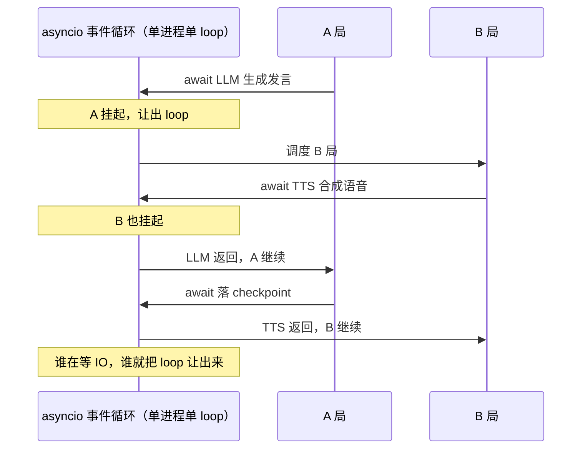
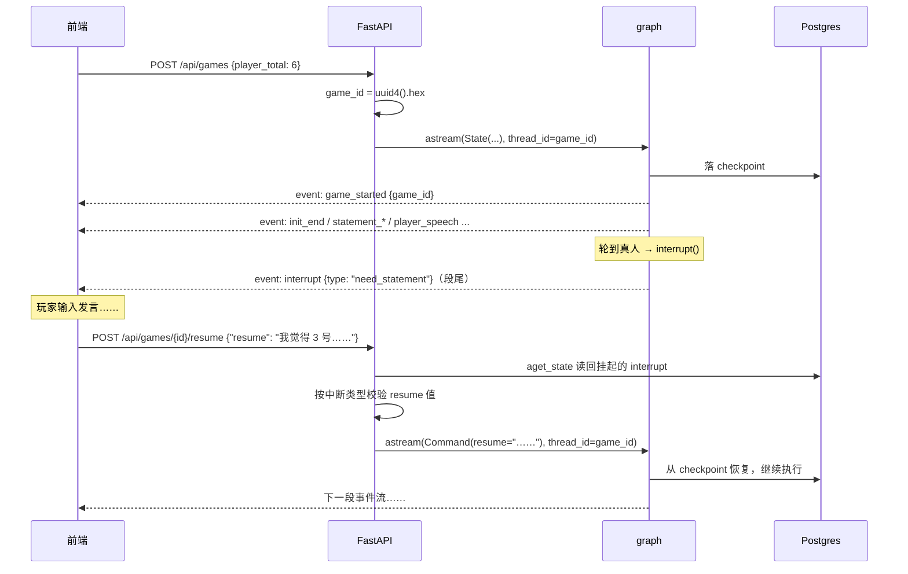
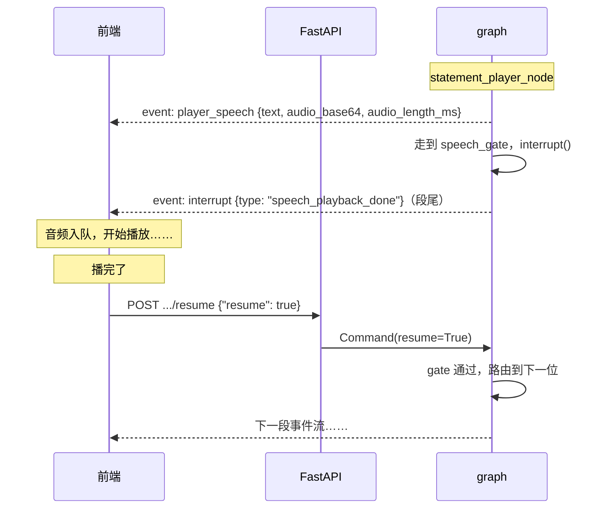
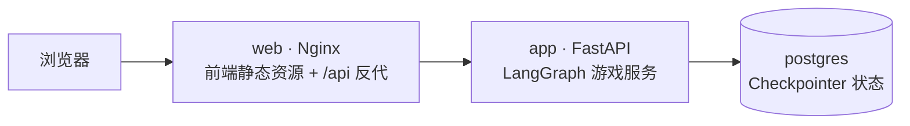

# LangGraph 实战（二）：把游戏内核变成一个能上线的服务

[上一篇](langgraph-who-is-spy-1-game-core.md)把「谁是卧底」的游戏内核写完了：状态图、结构化输出、并行投票、事件流、`interrupt` / `resume`，在终端里已经能完整跑一局。

项目开源在这里，可以直接对照代码看：

> **https://github.com/xvrzhao/who-is-spy**

但终端里的 demo 和线上的服务之间，隔着一堆 LangGraph 不负责的事：

- 一局游戏要跨好几个 HTTP 请求，状态存哪儿、进程重启了怎么办？
- 好几个玩家同时在玩，服务端怎么并发地跑好几张图？
- 图跑到哪一步了，前端怎么实时知道？
- 前端收到那个 `interrupt` 之后，凭什么能让服务端的图接着往下跑？
- 语音是前端播的、图是后端跑的，两边节奏怎么对齐？
- 半夜出问题了，怎么从日志里定位到是哪一局、哪一步？

这篇就是回答这些问题的。按照「先看问题、再看方案」的顺序走，一共十个小节，每节一个具体的问题。

## 问题一：一个事件循环怎么同时跑好几局？

先看最底层的执行模型。

### 从 `asyncio.run` 到 uvicorn 的单进程

内核在 CLI 里是这样起来的：

```python
if __name__ == "__main__":
    asyncio.run(main())
```

服务端换成了 uvicorn 拉起 FastAPI：

```bash
uvicorn src.main:app --host 0.0.0.0 --port 8000
```

注意这里**没有 `--workers`**。所以线上就是**一个进程、一个事件循环**，所有对局、所有节点、所有 LLM 和 TTS 请求都跑在这一个 loop 上。

`sleep` 一秒钟，所有玩家一起卡一秒——这是这个模型的基本约束。

### `async def` 和 `def` 的分界线

顺着这个约束回头看节点代码，会发现一个有意思的现象：节点有的是 `async def`，有的就是普通的 `def`。

异步的那几个：

```python
async def statement_player_node(state: State) -> State:
async def voting_player_node(state: VotingState) -> State:
async def exchange_session_player_node(state: State) -> State:
async def game_init_node(state: State) -> State:
```

同步的那几个：

```python
def statement_start_node(state: State) -> State:
def statement_speech_gate_node(state: State) -> State:
def voting_end_node(state: State) -> State:
def route_after_statement(state: State) -> str:
```

分界线很清晰：**这个节点需不需要 `await`**。

- `statement_player_node` 要 `await` LLM、要 `await` TTS，所以是 `async def`；
- `statement_player_node` 要 `await` LLM 和 TTS，所以是 `async def`；
- `voting_end_node` 只是把票数算一遍，纯 CPU，同步就够。

这个划分不只是代码风格。LangGraph 执行同步节点时会把它派到线程池里跑，所以**同步节点里的 CPU 计算不会阻塞事件循环**——`voting_end_node` 那个计票循环虽然写在同步函数里，也不会把别的游戏卡住。

反过来说，这个约定也给我们提了个醒：**别在 `async def` 里写阻塞调用**。这一点下面还要踩一个具体的坑。

### 并发到底从哪来

刚接触这个项目时我找了一圈 `asyncio.gather` 和 `asyncio.create_task`，结果是**一处都没有**。

不是因为不需要并发，而是**并发全部由 LangGraph 的 superstep 承担了**。六个玩家同时投票，靠的是 `Send` 扇出（上一篇第五节），而不是在节点里 `gather` 六个协程。

两件事的区别值得说清楚：

- `asyncio.gather` 是**协程级**的并发：你手动管理任务的创建和结果合并；
- `Send` 是**图级**的并发：LangGraph 负责派生分支、等所有分支完成、按 reducer 合并状态、并在 superstep 边界落 checkpoint。

后者多出来的东西（状态合并、checkpoint 一致性、分支里的 `interrupt`）恰好都是这个游戏真正需要的。所以图的内部一个 `gather` 都没有，反而说明设计是对的。

一个 loop 上多局游戏交错执行，大致是这个样子：



### 顺着这条线自查：两处欠账

这个约定立好之后，拿它回头审一遍代码，有两处不合格。

**欠账一：每次 TTS 都新建一个 `httpx.AsyncClient`。**

```python
    async with httpx.AsyncClient(timeout=REQUEST_TIMEOUT) as client:
        resp = await client.post(T2A_URL, json=payload, headers=headers)
```

每次调用都重新建连接池、重新 TLS 握手。全项目没有共享的 `httpx.AsyncClient`——如果按「问题二」的思路做，这个 client 应该跟连接池一样，在 lifespan 里建好、全局复用。

**欠账二：TTS 的降级路径用了 `print`。**

```python
    except Exception as e:
        print(f"[TTS 降级] player {player_id}: {e!r}")
```

异步本身没问题，但这一行绕过了问题五要讲的日志系统——它没有 `trace_id`，也没有 JSON 格式，生产环境里就是一行裸文本混在结构化日志中间。**降级是要被观察的事件，不是「顺便打个招呼」**，它应该走 `logger.warning`。

### 一个我一开始搞错的点

写完上面两条，我本来还想写第三条：「`tenacity` 的 `wait_fixed(1)` 是同步睡眠，会阻塞事件循环」。

代码如下：

```python
@retry(
    retry=retry_if_exception_type((httpx.TransportError, httpx.HTTPStatusError, TTSError)),
    stop=stop_after_attempt(3),
    wait=wait_fixed(1),
    reraise=True,
)
async def synthesize(text: str, voice_id: str) -> tuple[bytes, int]:
```

`wait_fixed` 听起来就是「固定等一秒」，而 `time.sleep` 在 `async def` 里是经典错误，所以这个结论看起来很合理。

但我去翻了一下 tenacity 的源码，发现是错的：**`wait_fixed` 本身只返回「该等多少秒」，从不睡眠**——`wait_fixed.__call__` 的实现就是 `return self.wait_fixed`。真正睡眠的是 `Retrying` 对象，而 `@retry` 装饰器会检测被装饰的函数是不是协程函数，是的话自动实例化 `AsyncRetrying`，它的默认 sleep 是 `_portable_async_sleep`，也就是 `await asyncio.sleep(...)`。

所以这段代码**没有任何阻塞问题**，不需要改。

把这条留下来，是因为它比前两条更有价值：**「看起来很合理的性能结论」也得验证过再写。** 如果当时按直觉改了，等于把一段正确的代码改成另一段正确的代码，还顺手给自己加了个「我修过这个 bug」的错觉。（真要用同步的等待函数或者自己手写重试循环，这一秒才会真的卡住整个 loop。）

## 问题二：谁来管生命周期？

`httpx.AsyncClient` 该复用、数据库连接池该建一次、图该编译一次——这些「全局只做一次、用完要收」的东西，在 FastAPI 里有专门的去处：`lifespan`。

`backend/src/main.py` 全文：

```python
import logging
from contextlib import asynccontextmanager

from fastapi import FastAPI
from fastapi.middleware.cors import CORSMiddleware

from src.core.logging import setup_logging
from src.core.config import settings
from src.core.middlewares.trace import TraceMiddleware
from src.core.checkpointer import checkpointer_provider
from src.core.graph import graph_provider
from src.domains import router

setup_logging()
logger = logging.getLogger(__name__)
logger.info("application environment variables: %s", settings.model_dump_json())

@asynccontextmanager
async def lifespan(app: FastAPI):
    await checkpointer_provider.init()                      # 初始化 psycopg 连接池 + checkpoints 建表
    graph_provider.init(checkpointer_provider.saver)        # 编译游戏 graph
    yield
    await checkpointer_provider.shutdown()

app = FastAPI(
    title=settings.APP_NAME,
    lifespan=lifespan,
)

app.add_middleware(
    CORSMiddleware,
    allow_origins=settings.ALLOW_ORIGINS,
    allow_credentials=True,
    allow_methods=["*"],
    allow_headers=["*"],
)
app.add_middleware(TraceMiddleware)

app.include_router(router)
```

`yield` 之前是启动阶段，之后是关停阶段。这里做了三件事，顺序不能乱：

1. 建 Postgres 连接池；
2. 用那个连接池建 `AsyncPostgresSaver` 并建表；
3. 拿 saver 编译图。

### 为什么必须放在 `lifespan` 里

这三种东西都不能写在模块顶层。写在 import 期有两个问题：一是**没有地方 `await`**（模块导入是同步的），二是**没法释放**。

更重要的是 `lifespan` 给了一个明确的语义边界：`yield` 之前一切就绪，之后一切回收。写在这里的代码，读的人一眼就知道它的生命周期跟着进程走。

失败语义也很干脆：**Postgres 连不上，`pool.open()` 抛异常，应用直接起不来**。这是有意的 fail-fast——与其让服务半死不活地跑着、等第一个玩家来开局时才报错，不如启动时就明确失败。`docker-compose.yml` 里配了 healthcheck 和 `depends_on`，就是为了让 app 等 Postgres 真的能用了再启动（部署那节会看）。

### 图编译一次，所有对局共用

`graph_provider.init()` 里做的事很简单：

```python
    def init(self, checkpointer: Checkpointer):
        self.checkpointer = checkpointer
        self.graph = build_graph(self.checkpointer)

        logger.info("graph init: graph compiled")
```

**图在启动时编译一次，之后所有对局共享这一个实例。**

这一点刚上手时会有点反直觉——「一局游戏一个图实例」听起来更自然。但 LangGraph 的设计是：**图（结构）和状态（数据）是分开的**。图只描述「怎么走」，状态靠 `thread_id` 区分。所以一个编译好的图可以被任意多局游戏并发使用，每局的进度互不干扰。

官方文档里说的「compile 是相对重的操作，建议做一次」，在这里就是字面意思地省下了一笔开销。

## 问题三：checkpointer 的连接池怎么建？

上一节 `lifespan` 里的第一件事，展开来看。

`backend/src/core/checkpointer.py` 全文：

```python
from logging import getLogger

from psycopg_pool import AsyncConnectionPool
from langgraph.checkpoint.postgres.aio import AsyncPostgresSaver

from src.core.config import settings

logger = getLogger(__name__)

class CheckpointerProvider:

    def __init__(self):
        self.pool: AsyncConnectionPool | None = None
        self.saver: AsyncPostgresSaver | None = None

    async def init(self):
        self.pool = AsyncConnectionPool(
            conninfo=settings.postgres_uri,
            max_size=settings.PG_CONN_MAX,
            kwargs={"autocommit": True},
            open=False,
        )
        await self.pool.open()

        self.saver = AsyncPostgresSaver(self.pool)
        await self.saver.setup() # 幂等建 checkpoints 相关表

        logger.info("checkpointer init: postgres checkpointer setup complete")

    async def shutdown(self):
        if self.pool is not None:
            await self.pool.close()
            
        logger.info("checkpointer shutdown: postgres connection pool closed")


checkpointer_provider = CheckpointerProvider()
```

几处值得说明的细节。

**`kwargs={"autocommit": True}` 是硬要求。** `AsyncPostgresSaver` 在工作时自己管理事务边界，如果连接不是 autocommit，它会和外层事务打架，报一些很难看懂的错。这个参数官方文档里有提，但容易漏。

**`open=False` 再显式 `open()`。** 构造时不连接，把「什么时候真正建连接」这件事交回给 `lifespan`。这样连接池的建立时机和生命周期是同一个节奏，不会出现「模块一 import 就往数据库连」的情况。

**`setup()` 是幂等的。** 它会建 `checkpoints` 系列的表，已经存在就跳过。放在启动流程里反复跑没问题——所以本地开发时删库重建、容器重启都不需要额外的初始化步骤。

**`max_size` 决定能同时开几局。** 每一局在跑的时候会占着连接做 checkpoint 读写，`PG_CONN_MAX` 默认 10。这个数字要和「预期并发局数」对齐，配小了会出现「排队等连接」，配大了只是浪费。

### 为什么要做成 Provider 而不是模块级全局变量

回到上一篇的那个注入点：

```python
graph_provider.init(checkpointer_provider.saver)
```

`CheckpointerProvider` 是个类，`checkpointer_provider` 是它的一个实例。如果只是要一个全局的连接池，直接写模块级变量更省事：

```python
# 反例
pool = AsyncConnectionPool(...)
saver = AsyncPostgresSaver(pool)
```

做成 Provider 的好处有两个：

1. **能 `await`**。模块级变量没法在导入时 `await self.pool.open()`，只能靠 `open=True` 或用各种 hacky 的惰性初始化；
2. **有对称的 `shutdown`**。有 `init` 就该有 `close`，两者写在同一个类里，读者不会漏掉「这东西要关」。

而 `build_graph(checkpointer)` 的注入式设计，让这套 Provider 成了**服务端专属的实现细节**——内核根本不知道它的存在（CLI 用 `InMemorySaver` 就走另一条路）。

## 问题四：项目怎么分层？为什么有两套配置？

代码多了之后，最怕的是「不知道该把东西放哪儿」。这个后端的分层原则很简单，可以直接看目录：

```
backend/src/
├── main.py                # 入口：日志、lifespan、中间件、路由
│
├── domains/               # HTTP 协议层
│   ├── __init__.py        # 总路由（/api）
│   └── game/
│       ├── endpoints.py   # 路由处理函数
│       └── schemas.py     # 请求 / 响应模型
│
├── core/                  # 基础设施
│   ├── config.py          # 配置
│   ├── checkpointer.py    # 连接池 + checkpointer
│   ├── graph.py           # 图的生命周期 + SSE 适配
│   ├── ctx.py             # 请求级上下文变量
│   ├── middlewares/       # 中间件
│   ├── logging/           # 日志
│   │
│   └── game/              # 游戏内核（对服务器零依赖）
│       ├── graph.py  state.py  events.py
│       ├── nodes/  prompts.py  llm.py  tts.py  cli.py
│
└── utils/
    └── sse.py             # SSE 帧构造
```

划分标准是**「这件事属于谁」**：

- `domains/` 只处理 HTTP 协议范畴的事：路由、请求校验、响应该用什么 content-type。它不做任何游戏逻辑；
- `core/` 放基础设施：配置、日志、连接池、中间件、以及图的运行宿主；
- `core/game/` 是**游戏内核**，它不 import `fastapi`、不 import `psycopg`、也不 import 服务器侧的 `core.config`。上一篇那些代码全在这里。

这条边界不是画着好看的。它换来一个很实际的能力：**内核可以被单独抽出去**。CLI 能在终端跑一局完整的游戏，靠的就是这一点。

### 两套配置是有意的

既然要解耦，配置也得跟着分开。

服务器侧的配置走 pydantic-settings：

```python
class Settings(BaseSettings):
    ENV: Environment = Environment.DEVELOPMENT
    APP_NAME: str = "who-is-spy"

    ALLOW_ORIGINS: list[str] = []

    PG_HOST: str = "localhost"
    PG_PORT: int = 5432
    PG_DB: str = "who_is_spy"
    PG_USER: str = "postgres"
    PG_PSW: SecretStr = SecretStr("postgres")
    PG_CONN_MAX: int = 10

    # 说明：游戏侧配置（LLM_API_KEY / MINIMAX_API_KEY / MINIMAX_TTS_MODEL）由 src/game 的
    # load_dotenv()+getenv 直接读取同一个 .env，Settings 的 extra="ignore" 会跳过它们，
    # 保持 src/game 对服务器基础设施零依赖（CLI 可脱离 FastAPI/PG 独立运行）

    model_config = SettingsConfigDict(
        env_file=".env",
        env_file_encoding="utf-8",
        case_sensitive=True,
        extra="ignore",
    )
```

而游戏侧的 `LLM_API_KEY`、`MINIMAX_API_KEY` 是内核自己读的，绕过了 `Settings`：

```python
# core/game/llm.py
load_dotenv()
llm = ChatOpenAI(..., api_key=getenv("LLM_API_KEY"), ...)
```

**两套配置读的是同一个 `.env` 文件**，但由不同的代码负责。这样 `core/game/` 里没有任何一行 import 到 `core/config.py`——把内核整个目录拷到另一个项目，它照样能跑。

`extra="ignore"` 是让这件事成立的关键：`Settings` 遇到自己没声明的环境变量（比如 `MINIMAX_API_KEY`）会直接跳过，而不是报错。

代价是**同一个 `.env` 里混了两类变量**，新同事可能会困惑「为什么这个 key 在 Settings 里找不到」。所以那三行注释是必要的，它把这个约定写在了最显眼的位置。

## 问题五：出问题时，怎么把日志串起来？

一局游戏要跑几分钟，中间穿插着 LLM 调用、TTS 调用、数据库写入。真出问题的时候，日志里是好几局游戏的输出交织在一起。**怎么知道哪几行属于同一局？**

### 结构化日志配置

日志用 `dictConfig` 声明式地配，全部逻辑在一个函数里：

```python
def setup_logging():
    os.makedirs("logs", exist_ok=True)

    logging_config = {
        "version": 1,
        "disable_existing_loggers": False,

        "formatters": {
            "default": {
                "()": "src.core.logging.formatters.colored_formatter.ColoredFormatter",
                "fmt": "[%(asctime)s] [%(levelname)s] <%(name)s> %(pathname)s:%(lineno)d (%(funcName)s): trace-id-%(trace_id)s | %(message)s",
            },
            "json": {
                "()": "src.core.logging.formatters.json_formatter.JSONFormatter",
            },
        },
        # ...
    }

    logging.config.dictConfig(logging_config)
```

两个 formatter 各有各的用途：

- **开发环境**用带颜色的格式，人眼好读；
- **生产环境**输出 JSON，一条日志一行，方便采集和检索。

切换逻辑在 handler 上：

```python
            "console": {
                "class": "logging.StreamHandler",
                "formatter": "json" if settings.is_production else "default",
                "stream": sys.stdout,
                "filters": ["trace"],
            },
            "file": {
                "class": "logging.handlers.RotatingFileHandler",
                "formatter": "json",
                "filename": "logs/app.log",
                "maxBytes": 500 * 1024 * 1024,   # 500MB
                "backupCount": 10,
                "encoding": "utf-8",
                "filters": ["trace"],
            },
```

文件 handler 只在生产挂上，`RotatingFileHandler` 单文件 500MB、留 10 个备份。**注意两个 handler 都挂了同一个 `trace` filter**，这是下一段的主角。

最后一个容易忽略但很省事的配置——**给第三方库降噪**：

```python
        "loggers": {
            "uvicorn": {"level": "INFO", "propagate": True},
            "uvicorn.access": {"level": "WARNING", "propagate": True},
            "httpcore": {"level": "INFO", "propagate": True},
            "httpcore2": {"level": "INFO", "propagate": True},
            "sqlalchemy.engine": {"level": "WARNING", "propagate": True},
            "openai": {"level": "INFO", "propagate": True},
            "httpx": {"level": "WARNING", "propagate": True},
        },
```

root 是 `DEBUG`，如果不管这些库，`httpx` 会把每个请求的 header、`sqlalchemy` 会把每条 SQL 全打出来，自己的日志直接被淹掉。给它们单独定级，是让 `DEBUG` 真正可用的前提。

### 链路追踪三件套

要让同一局游戏的日志能串起来，需要三样东西。

**第一样：一个请求级的上下文变量。**

```python
from contextvars import ContextVar


trace_id_var: ContextVar[str] = ContextVar("trace_id", default="global")

def set_trace_id(trace_id: str):
    trace_id_var.set(trace_id)

def get_trace_id() -> str:
    return trace_id_var.get()
```

**第二样：一个中间件，给每个请求分配（或透传）trace id。**

```python
TRACE_ID_HEADER = "X-Trace-Id"

class TraceMiddleware(BaseHTTPMiddleware):
    async def dispatch(self, request: Request, call_next: RequestResponseEndpoint) -> Response:
        trace_id = request.headers.get(TRACE_ID_HEADER, str(uuid4()))
        ctx.set_trace_id(trace_id)
        response = await call_next(request)
        response.headers[TRACE_ID_HEADER] = trace_id
        return response
```

请求头里带了 `X-Trace-Id` 就沿用（方便上游网关或前端串联），没带就生成一个。处理完再把它回写到响应头，前端出问题时可以把 trace id 直接报给后端。

**第三样：一个 logging filter，把上下文变量塞进每条日志。**

```python
class TraceFilter(logging.Filter):
    def filter(self, record):
        record.trace_id = ctx.get_trace_id()
        return super().filter(record)
```

三样东西加起来，效果就是日志格式里那个 `trace-id-xxx`：

```
[2026-10-06 15:22:41,318] [INFO] <src.core.checkpointer> .../checkpointer.py:28 (init): trace-id-9f3c... | checkpointer init: postgres checkpointer setup complete
```

出问题时拿 trace id 一搜，这个请求相关的行全出来了。

### 顺带一个中间件顺序的坑

`main.py` 里注册中间件是这么写的：

```python
app.add_middleware(
    CORSMiddleware,
    allow_origins=settings.ALLOW_ORIGINS,
    allow_credentials=True,
    allow_methods=["*"],
    allow_headers=["*"],
)
app.add_middleware(TraceMiddleware)
```

看起来是先加 CORS、后加 Trace，直觉上以为 CORS 在外层。**实际上反了**：Starlette 的 `add_middleware` 是往用户中间件栈的**头部**插入，所以后注册的 `TraceMiddleware` 反而在最外层。

这个顺序在这里恰好是对的——trace id 要在最早的时候设置好，后续所有日志（包括 CORS 处理过程中的）才能带上它。但如果哪天想加一个「统计整个请求耗时」的中间件，就得注意它会被放在哪一层，以及它测到的时间包不包括 trace id 生成的耗时。

**中间件的顺序是个隐式契约，值得在代码里留一句注释。**

### 为什么用 `ContextVar` 而不是全局变量

这是这套方案里唯一需要动脑子的地方。

如果用一个模块级全局变量存 trace id：

```python
# 反例
current_trace_id = None

def set_trace_id(tid):
    global current_trace_id
    current_trace_id = tid
```

那么 A 局刚设完，B 局的请求进来把它覆盖掉，A 局后续的日志就全打上 B 局的 id 了——**异步并发下，全局变量在逻辑上根本不成立**。

`ContextVar` 解决的正是这个问题：**它的值是「每个执行上下文各自一份」**。每个请求由 asyncio 在自己的任务里执行，任务之间互不干扰，所以 A 局和 B 局可以同时持有各自的 trace id。

`logging.Filter` 恰好在每条日志产生的瞬间去读这个变量，读到的自然是当前上下文的值。

### 一个诚实的补充

`ContextVar` 只在**同一个执行上下文**里有效。而 LangGraph 的节点是在它自己的调度任务里跑的——这个上下文不一定继承 HTTP 请求的 `ContextVar`。所以**图内部的日志（如果有）很可能打的是默认值 `global`，而不是那一局的 trace id**。

这个项目里没有为它做额外处理，因为图内部基本不写日志——**图的进度是靠 `emit()` 发事件回报的**（上一篇第六节）。事件流本身就成了可观测性的一部分，这比日记更直接。

真要做全链路的追踪，得用 `copy_context()` 或者在节点里显式设置 trace id。这里先记一笔。

## 问题六：一次请求怎么变成一段事件流？

基础设施搭好了，现在看接口怎么把图的执行结果实时推出去。

### 先说一个协议选择

浏览器原生的 `EventSource` 用起来最省事，但它**只支持 GET**——没法带请求体。

这个项目里，「开局」要传玩家数量，「继续」要传玩家的输入，都需要 body。所以没有用 `EventSource`，而是走 **POST + `fetch` 流式读取响应**：

```javascript
// 前端大致是这样
const resp = await fetch(url, {
  method: 'POST',
  headers: { 'Content-Type': 'application/json', Accept: 'text/event-stream' },
  body: JSON.stringify(body),
})
const reader = resp.body.getReader()
```

拿到 reader 之后按 `\n\n` 分帧、解析 `event:` / `data:` 行，就是标准 SSE 帧。协议本身没变，只是传输方式换成了 POST。（前端分帧的细节不多讲，它和 `utils/sse.py` 里的帧格式是严格对应的。）

后端的帧构造就三行：

```python
def sse_event(event: str, data: dict) -> str:
    """构造 SSE 消息帧"""
    return f"event: {event}\ndata: {json.dumps(data, ensure_ascii=False)}\n\n"
```

`ensure_ascii=False` 让中文按 UTF-8 原样输出，而不是变成一堆 `\uXXXX`——省点带宽，调试时也看得懂。

### 图的执行怎么接到 SSE 上

核心在 `GraphProvider.run_graph`：

```python
    async def run_graph(self, thread_id: str, graph_input) -> AsyncIterator[str]:
        """运行 graph 直到中断或结束"""

        try:

            # 运行 graph 并 yield 游戏进度事件
            async for chunk in self.graph.astream(
                graph_input, 
                self.get_config(thread_id), 
                stream_mode=["custom"], 
                version="v2"
            ):
                if chunk.get("type") != "custom":
                    continue
                event = chunk["data"]
                if isinstance(event, Event):
                    yield self.game_event_to_sse(event)

            # 运行完毕，最后 yield 中断或结束事件
            state = await self.graph.aget_state(self.get_config(thread_id))
            if state.interrupts:
                yield sse_event("interrupt", state.interrupts[0].value)
            else:
                yield sse_event("finished", {})

        except Exception as e:

            logger.exception("game %s run failed", thread_id)
            yield sse_event("error", {"type": type(e).__name__, "message": str(e)})
```

它是个**异步生成器**，产出的就是 SSE 帧字符串。`astream` 拿到一帧就 `yield` 一帧，FastAPI 的 `StreamingResponse` 把它写进 HTTP 响应体，前端立刻收到。**全程没有缓冲、没有轮询。**

这段代码里有三个设计点。

**第一，只订阅 `custom` 流。** 代价是拿不到 token 级输出，收益是前端只收到「有意义的里程碑」——而自定义事件是唯一一种能精确控制「推什么」的流。（`updates` 流会把每个节点返回的状态增量推出去，其中包括 `history` 里那些私密独白，那正好是上一篇费劲藏起来的东西。）

**第二，段尾三选一。** `astream` 的循环结束后，一定有且仅有一帧收尾：

| 段尾帧 | 含义 |
|---|---|
| `interrupt` | 图挂起了，等前端输入 |
| `finished` | 整局结束 |
| `error` | 运行异常 |

为什么要有这个约定？因为**前端需要判断这条流是不是正常结束的**。一个 SSE 流正常结束和网络断掉，在 `for await` 看来都是「循环退出了」。有了段尾帧，前端就能区分：没收到三者之一就是断线，可以报错给用户。

**第三，异常也走事件流。** `try/except` 把异常包成 `error` 帧发出去，而不是让连接直接炸掉。这样前端拿到的是一个结构化错误（类型 + 消息），能展示得比「网络错误」清楚得多。

### SSE 响应头：几个必须的字段

```python
SSE_HEADERS = {
    "Cache-Control": "no-cache, no-transform", # 防止 nginx 缓存导致前端收不到实时数据
    "Connection": "keep-alive",
    "X-Accel-Buffering": "no",
}
```

`no-transform` 和 `X-Accel-Buffering: no` 都是给中间的反向代理看的——**告诉它「别缓冲这个响应」**。代理一旦缓冲，事件就会攒着一起发，实时性直接没了。

这里有个容易搞混的点：**nginx 认的是响应头，不是配置项**。它的文档里写得很清楚，`proxy_buffering` 的开关「也可以由响应头 `X-Accel-Buffering` 传 `yes`/`no` 来启用或禁用」。所以后端那一行响应头**单独就能生效**，哪怕 nginx 那边什么都不配。

那 `nginx.conf` 里为什么还要再关一次？

```nginx
    # API 反代。SSE 为 POST 长连接：必须关缓冲；Agent 一轮 LLM+TTS 可长时间无帧，
    # 读写超时放宽到 10 分钟，避免流被 nginx 掐断
    location /api/ {
        proxy_pass http://app:8000;
        proxy_http_version 1.1;
        proxy_set_header Connection "";
        proxy_buffering off;
        proxy_cache off;
        proxy_read_timeout 600s;
        proxy_send_timeout 600s;
    }
```

`proxy_buffering off` 在这里是**第二道保险**：它让整个 `/api/` location 默认就不缓冲，不必依赖每个响应自己带对头。真要出事，也是「哪天有人加了 `proxy_ignore_headers X-Accel-Buffering;`，把响应头这一路废掉了」——那时候这条配置就是唯一的防线。

而 `proxy_read_timeout 600s` 是**真正必需**的一条，没有替代品：**Agent 一轮「LLM 生成 + TTS 合成」可能好几分钟没有一帧输出**。nginx 默认 60 秒就会把这种「长时间没数据的连接」掐掉。放宽到 10 分钟，是为了让这种安静期不致命。

### 没有心跳，是个取舍

标准 SSE 有个 `:` 开头的注释行，可以当心跳用，定期发一个让连接保持活跃。这个项目**没有做心跳**。

代价是：如果某一轮 LLM + TTS 特别慢（超过 10 分钟），或者中间网络设备静默断开，前端要等到超时才知道。

收益是：代码简单，而且**确实没有触发过这个问题**——游戏本身一轮就是几十秒量级。真要做的话，在 `run_graph` 里起一个定时发注释行的任务就行。

## 问题七：前端收到中断，怎么让后端继续跑？

这是整个前后端交互里最核心的一个问题。

### 一个请求 = 一段流

先把上一篇的时序图换个角度看。**一个 HTTP 请求不是「一局游戏」，而是「一段」**：

```
POST /api/games              → 流开始 …… 到第一个 interrupt 结束
POST /api/games/{id}/resume  → 流开始 …… 到下一个 interrupt 结束
POST /api/games/{id}/resume  → 流开始 …… 到下一个 interrupt 结束
...
POST /api/games/{id}/resume  → 流开始 …… 到 finished 结束
```

**`interrupt` 就是这条流的分页符。** 前端每收到一个 `interrupt` 帧，就知道这一段结束了、现在该自己出于某种原因做点事了：

- `need_statement` / `need_exchange` → 弹出输入框，等玩家打字；
- `need_vote` → 弹出投票面板；
- `speech_playback_done` → 不用问玩家，等音频播完就自动继续。

做完之后再发一次 resume，开一段新的流。

这个模型的好处，在第一篇第七节已经体现出来了：**服务端不需要维护「当前有哪些局在跑」这种内存状态**。状态全在 Postgres 里，HTTP 连接只是驱动它往前走的一根绳子。断开、重连、换一个请求都无所谓——只要 `thread_id` 还在，游戏就在。



### 一个接口要接四种不同类型的数据

问题来了：`resume` 传什么，**取决于当前挂在哪个 `interrupt` 上**。

| 中断类型 | resume 传什么 |
|---|---|
| `need_statement` | 字符串（玩家发言） |
| `need_vote` | 整数（目标玩家 ID） |
| `need_exchange` | 字符串 `"发言内容\|\|下一位玩家ID"` |
| `speech_playback_done` | `true` |

请求体的类型是不固定的：一会儿是字符串，一会儿是数字，一会儿是布尔值。Pydantic 模型只能写成 `Any`：

```python
class ResumeRequest(BaseModel):
    """
    resume 取值由 pending interrupt 的类型决定：
    - need_statement: 字符串（真人发言）
    - need_vote: 数字（玩家 ID，0 表示弃票）
    - need_exchange: 字符串，格式 "发言内容||下一位玩家ID"
    - speech_playback_done: true（客户端语音播放完成确认）
    """
    resume: Any
```

`Any` 意味着**类型校验完全失效**。如果前端传错了（比如投票时传了字符串 `"3"`），图里拿到的就是错的东西，可能在很深的地方炸出来一个莫名其妙的异常。

### 让服务端自己去查「现在挂在哪」

解法很直接：**接口不信任客户端说的，而是从 checkpoint 里读回当前挂起的 interrupt，按它的类型来校验**。

```python
def _is_int_str(s: str) -> bool:
    return s.strip().lstrip("-").isdigit()


RESUME_VALIDATORS = {
    "need_statement": lambda v: isinstance(v, str) and bool(v.strip()),
    "need_vote": lambda v: isinstance(v, int) and not isinstance(v, bool),
    "need_exchange": lambda v: isinstance(v, str) and "||" in v and _is_int_str(v.rsplit("|", 1)[1]),
    "speech_playback_done": lambda v: v is True,
}


@router.post("/{game_id}/resume", summary="中断继续")
async def resume_game(game_id: str, req: ResumeRequest):
    graph = graph_provider.graph
    state = await graph.aget_state(graph_provider.get_config(game_id))

    interrupt: dict = state.interrupts[0].value
    validator = RESUME_VALIDATORS.get(interrupt["type"])
    if validator and not validator(req.resume):
        raise HTTPException(422, f"invalid resume payload for {interrupt["type"]}: {req.resume!r}")

    stream = graph_provider.stream_resume(game_id, req.resume)
    return StreamingResponse(
        stream,
        media_type="text/event-stream",
        headers=SSE_HEADERS,
    )
```

关键在于 `aget_state()` 那一行：**请求里根本没有「我现在是什么中断」这个字段**，服务端自己去数据库里查。这样客户端无从伪造——它没法谎称「我在投票阶段」然后传一个投票格式的值。

校验规则本身也有些细节：

- `need_vote` 的 `not isinstance(v, bool)`：Python 里 `True` 也是 `int`，不排除的话 `true` 会被当成「投给玩家 1」。**JSON 的 `true` 会反序列化成 Python 的 `True`**，而它是 `int` 的子类——这个坑不踩一次不会想到；
- `need_exchange` 用 `rsplit("|", 1)` 而不是 `split`：发言内容里可能自己就带 `|`，只从最后一段切分才能拿到玩家 ID。（注意校验器里切的是**单个** `|`，而节点里还原用的是 `rsplit("||", 1)`——因为格式本身是 `内容||ID`，校验时只需要确认「最后一个 `|` 后面是数字」，切一个字符就够；节点要真正拆成两段，就得切双竖线。）
- `speech_playback_done` 用 `v is True`：严格判断，不接受「truthy 的值」。

### 一处可以更好的地方

如果 `state.interrupts` 是空的（比如重复调用了一次 resume，图已经往前走了；或者这个 `game_id` 根本不存在），`state.interrupts[0]` 会抛 `IndexError`，最后变成 **500**。

语义上这更像 **409 Conflict**（「当前状态不允许这个操作」）而不是服务端错误。改成：

```python
    if not state.interrupts:
        raise HTTPException(409, "no pending interrupt for this game")
```

会让调用方拿到更准确的信号。这是目前代码里一个明确的小缺口。

## 问题八：语音播放是客户端的，图执行是服务端的，怎么不打架？

这个问题第一篇埋了伏笔，这里说清楚为什么那样设计。

### 三个朴素方案都不行

需求是：**Agent 说完一句话，等这句语音在浏览器里播完，再让下一位说。**

- **服务端 `sleep(音频时长)`**：时长是 MiniMax 返回的，看起来能算。但网络抖动、浏览器解码延迟、用户切了标签页，都会让实际播放时间和这个数字对不上——几句之后就完全错位了。而且这一睡就把整个事件循环（问题一）堵住了；
- **前端播完发个请求通知后端**：听起来对，但服务端此时在干嘛？它得在一个地方「等着」这个通知。要么挂着一个 HTTP 请求，要么开一个共享状态 + 轮询——不管哪种，都要为「同步」单独维护一份状态，和「状态都在 checkpoint 里」的设计冲突；
- **轮询**：纯浪费，而且延迟不可控。

### 把「等播完」变成图里的一个中断

项目的做法是——**「等」这件事本身就是图的一步**。

```python
def statement_speech_gate_node(state: State) -> State:
    """等待客户端确认语音播放完成后再继续"""
    
    interrupt({"type": "speech_playback_done"})
    return {}
```

节点体就两行。整个协作过程是这样的：



**服务端什么都没等**。它发出 `speech_playback_done` 这个中断之后就结束了这一段流，进程该干嘛干嘛——其他对局照跑，内存里也不留任何「正在等语音」的标记。等前端准备好了，带着 `true` 回来，图从 `interrupt` 那一行继续。

这个设计带来四个好处：

1. **天然背压**。前端音频队列里还排着几条没播完，它就不 resume，服务端自然不会往前跑。**节奏的主动权在客户端手里**；
2. **服务端零等待、零轮询**。没有 sleep，没有定时器，没有为同步而生的共享状态；
3. **刷新页面也不乱**。中断状态落在 Postgres 里，用户刷新后重新拉一次状态，仍然停在同一个 gate 上；
4. **真人和 Agent 走同一套**。真人发言那一路也会走到这个 gate，只是前端没什么可播的，直接确认就行——**不用为「这轮是真人还是 Agent」写两套流程**。

### 降级路径也是通的

回到第一篇讲过的 TTS 降级：合成失败时 `PlayerSpeech` 事件里 `audio_base64` 是空串。前端一看没音频，跳过播放、立刻确认 gate。**降级不会让游戏卡在 gate 上**——这一点很关键，因为一个「永远等不到确认」的中断会让整局游戏永久挂起。

## 问题九：出错了怎么办？

一个跑了 LLM、TTS、数据库的在线服务，不可能不出错。这部分看三层防御。

### 第一层：图的运行异常 → `error` 帧

`run_graph` 的 `try/except` 把任何异常都变成一帧：

```python
        except Exception as e:

            logger.exception("game %s run failed", thread_id)
            yield sse_event("error", {"type": type(e).__name__, "message": str(e)})
```

`logger.exception` 会把完整堆栈写进日志（带上 trace id），发给前端的是精简过的类型 + 消息。**排查用日志，展示用事件**，两边互不干扰。

要注意的是，这个 `try` 覆盖的是**流开始之后**的异常。如果异常发生在流开始之前（比如 resume 接口里 `aget_state` 就失败了），那就是一个普通的 Starlette 500 JSON 响应，而不是 SSE 帧。前端得能同时处理这两种错误形态。

### 第二层：外部依赖降级

**TTS 有两级降级**：

```python
    if not MINIMAX_API_KEY:
        emit(PlayerSpeech(player_id=player_id, text=text))
        return

    try:
        audio, audio_length_ms = await synthesize(text, get_voice_id(player_id))
    except Exception as e:
        print(f"[TTS 降级] player {player_id}: {e!r}")
        emit(PlayerSpeech(player_id=player_id, text=text))  # audio_base64 默认空串
        return
```

没配 key 是「有意为之的降级」（开发环境就不想花钱调 TTS），合成失败是「意外降级」。两种情况前端表现一致：有字幕没声音，游戏继续。

**LLM 的结构化输出也有降级**（上一篇讲过）：GLM 偶尔不按约束返回工具调用，`with_structured_output` 会返回 `None`，所以包了一层重试：

```python
async def ainvoke_structured(runnable: Runnable, messages, attempts: int = 3):
    last = None
    for _ in range(attempts):
        last = await runnable.ainvoke(messages)
        if last is not None:
            return last
    raise RuntimeError(f"structured output 连续 {attempts} 次返回 None")
```

重试三次还是失败就抛异常，走第一层变成 `error` 帧。**要么重试成功，要么干净地失败，不会带着 `None` 往下走。**

### 第三层：前端判断连接是否正常

前面说的「段尾三选一」在这里发挥作用。前端从流里读到一个 `interrupt` / `finished` / `error`，就知道这一段正常结束了；如果流结束了却一个都没有，就判定为**中途断线**，直接告诉用户这局作废。

这也对应了一个**明确的产品决策：不支持断线续跑**。

从技术上讲，状态都在 Postgres 里，理论上完全可以做到「断线后重新拉起来接着玩」。但前端选择了不做——因为一局游戏的关键信息（谁在什么时候说了什么、语音播到哪了）有一部分只存在于客户端的内存里，硬接回来反而容易做出「看起来在继续、其实状态已经错乱」的体验。**明确地失败，比含糊地继续好。**

### 还缺的一层：全局异常处理

目前**没有注册任何 `@app.exception_handler`**。所有的错误处理都靠上面三层「就地解决」。

这意味着：任何在路由函数里抛出的、没有被 catch 的异常，返回的都是 Starlette 默认的 500 响应。对内部服务够用，但对一个面向公网的服务，最好加一个全局 handler：统一日志格式、统一响应结构、并且**不要把内部异常的细节直接吐给客户端**。

## 问题十：怎么部署？

最后看这套东西怎么跑起来。

### 三个容器



- `web`：Nginx，托管前端构建产物，并把 `/api/` 反代到后端。对外只暴露它一个（80 端口）；
- `app`：FastAPI 服务，**8000 端口不对宿主机发布**，只能通过 `web` 访问；
- `postgres`：只存 checkpoint，端口绑在 `127.0.0.1` 上。

**API 不对外发布**是有意的：同源访问就不需要处理跨域，也少了一个对外暴露面。前端请求 `/api/games`，看起来是访问自己的源，实际被 Nginx 转给了后端。

### 启动顺序靠 healthcheck 保证

`lifespan` 里第一件事就是连 Postgres，连不上就起不来（fail-fast）。所以 compose 里必须保证 Postgres 先就绪：

```yaml
  postgres:
    image: postgres:17
    healthcheck:
      test: ["CMD-SHELL", "pg_isready -U ${PG_USER:-postgres} -d ${PG_DB:-who_is_spy}"] # 退出码 0 为成功，其他为失败
      interval: 5s
      timeout: 3s
      retries: 6

  app:
    build: ./backend
    env_file: backend/.env
    environment:
      PG_HOST: postgres # 覆盖 PG_HOST 指向容器网络
    depends_on:
      postgres:
        condition: service_healthy
    healthcheck:
      test: ["CMD-SHELL", "python -c \"import socket; socket.create_connection(('127.0.0.1', 8000), timeout=3).close()\""]
      interval: 5s
      timeout: 3s
      retries: 6
      start_period: 20s
```

两个点值得注意。

**`condition: service_healthy`**，不是默认的 `service_started`。容器的「启动」和「Postgres 能接受连接」之间隔着好几秒，只用 `started` 的话 app 会稳定地启动失败。

**`PG_HOST: postgres` 覆盖**。`.env` 里写的是 `localhost`（本地开发用），容器里得指向服务名。用 `environment` 覆盖 `env_file` 的值，就不会为了容器单独维护一份配置。

### 别忘了 Nginx 这一层

部署时，SSE 能不能正常工作取决于这几项，问题六已经讲过原理，这里只列位置：

- 后端的响应头：`X-Accel-Buffering: no`、`Cache-Control: no-cache, no-transform`——**这一条是真正起作用的**，nginx 认它；
- Nginx 的 location：`proxy_buffering off`（第二道保险）；以及 `proxy_read_timeout 600s`——**这条没有替代品**，不加就会被默认的 60 秒超时掐断。

漏了会怎样？症状很迷惑：**本地开发一切正常**（直连后端、没有代理），一上线就变成「事件攒着一起出现」或者「一局跑到一半就断」。这类问题排查起来很费时间，值得在部署清单上单独列一条。

## 小结

回到开头那几个问题，答案现在都在代码里了：

| 问题 | 方案 |
|---|---|
| 多局并发怎么跑 | 单进程单事件循环，节点按「是否需要 await」分同步/异步，并发交给 LangGraph 的 superstep |
| 全局资源谁来管 | `lifespan` 里建连接池、建表、编译图；关停时回收 |
| checkpoint 存哪儿 | `AsyncConnectionPool`（autocommit）+ `AsyncPostgresSaver`，`setup()` 幂等建表 |
| 代码怎么分层 | `domains` 管 HTTP、`core` 管基础设施、`core/game` 是零依赖内核；配置也按这条线分成两套 |
| 日志怎么串起来 | `ContextVar` + logging `Filter` + `TraceMiddleware` 透传 `X-Trace-Id` |
| 图的执行怎么推给前端 | `astream(stream_mode=["custom"])` + `StreamingResponse`，段尾三选一帧 |
| 前端怎么让后端继续 | 一个请求一段流，`interrupt` 是分页符；resume 接口从 checkpoint 读回中断类型再校验 |
| 语音和图的节奏怎么对齐 | 把「等播完」做成图里的一个 `interrupt` 节点 |
| 出错了怎么办 | 三层：`error` 帧 / 依赖降级 / 前端段尾帧存活检测 |
| 怎么部署 | 三个容器，healthcheck 保证启动顺序，Nginx 关缓冲 + 放宽超时 |

回头看，LangGraph 负责的是「状态怎么流转」，剩下的事——生命周期、并发、可观测、协议、部署——都是常规的后端工程。**把一个 AI 应用做上线，大概就是这个比例**：图本身不复杂，难的是让它稳定地跑在真实环境里。

### 如果继续做，我会先动这几处

前面各节零散提到的欠账，汇总一下，都是我自己写完回头看才发现的：

| 位置 | 问题 | 怎么改 |
|---|---|---|
| `tts.py` 的请求 | 每次合成都新建 `httpx.AsyncClient`，重复握手 | 在 `lifespan` 里建一个共享 client |
| `tts.py` 的降级 | `print` 绕过日志系统，没有 trace id | 改成 `logger.warning` |
| resume 接口 | `state.interrupts` 为空时索引越界，返回 500 | 先判空，返回 409 |
| 全局异常 | 没有注册 `@app.exception_handler` | 加一个统一的 handler：统一日志、统一响应结构、不泄露内部细节 |
| 链路追踪 | 图内部的任务不继承 HTTP 的 `ContextVar` | 用 `copy_context()` 或在节点入口显式设置 trace id |
| 可观测性 | 没有心跳帧，也没有 metrics/健康检查接口 | SSE 定时发注释行；加 `/health` 区分「端口在 listen」和「依赖可用」 |

这些都不会让游戏跑不起来。但前两条会影响**其他对局**（一个是每次调用都多付一次握手，一个是降级时查不到案发经过），我会先动它们；后几条更多是完善度问题。

## 参考

- [LangGraph 官方文档](https://langchain-ai.github.io/langgraph/)
- [LangGraph: Persistence（checkpointer）](https://langchain-ai.github.io/langgraph/concepts/persistence/)
- [FastAPI: Lifespan Events](https://fastapi.tiangolo.com/advanced/events/)
- [Starlette: Responses（StreamingResponse）](https://www.starlette.io/responses/)
- [MDN: Server-sent events](https://developer.mozilla.org/en-US/docs/Web/API/Server-sent_events)
- [psycopg: Connection pools](https://www.psycopg.org/psycopg3/docs/advanced/pool.html)
- [Python 文档：contextvars](https://docs.python.org/3/library/contextvars.html)
- [项目源码：xvrzhao/who-is-spy](https://github.com/xvrzhao/who-is-spy)
